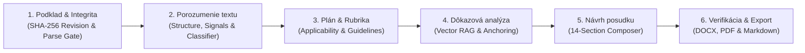

# PosterApp — Academic Reviewer: Master Reference

> **Consolidates:** `ACADEMIC_REVIEWER.md` · `PIPELINE_ARCHITECTURE_AND_PERFECTION_ROADMAP.md` · `CODING_AGENT_PROMPT_pipeline_perfection.md` · `HARDENING_AUDIT.md`
> **Last updated:** 2026-09-02

---

## Table of Contents

1. [Mission & Epistemic Invariants](#1-mission--epistemic-invariants)
2. [Six-Stage Pipeline (overview)](#2-six-stage-pipeline)
3. [Slovak Academic Rubric — `sk-academic-v1`](#3-slovak-academic-rubric--sk-academic-v1)
4. [Epistemic Taxonomy & Guardrails](#4-epistemic-taxonomy--guardrails)
5. [Security, IDOR & Confidentiality](#5-security-idor--confidentiality)
6. [Full Pipeline Architecture (deep read)](#6-full-pipeline-architecture-deep-read)
7. [Sophistication Scorecard (18 subsystems)](#7-sophistication-scorecard)
8. [Perfection Roadmap](#8-perfection-roadmap)
9. [Phase 2 Task Specs (Tasks 9–14)](#9-phase-2-task-specs-tasks-914)
10. [Validation Benchmarks & Test Matrix](#10-validation-benchmarks--test-matrix)
11. [Security Hardening Audit (current status)](#11-security-hardening-audit)

---

## 1. Mission & Epistemic Invariants

The **PosterApp Academic Reviewer** transforms the university thesis evaluation process (*"Posudok záverečnej práce"*) and scientific peer review into a rigorous, evidence-grounded, audit-proof academic intelligence system.

Unlike generic LLM text generators that hallucinate citations, invent experimental findings, or produce uniform praise/criticism, the Academic Reviewer enforces strict **epistemic grounding invariants**:

1. **Never fabricate evidence** — every claim regarding document content must cite a verbatim or normalized excerpt verified directly in the source text.
2. **Epistemic taxonomy** — every statement is classified into one of 6 distinct epistemic states (see §4).
3. **No ungrounded page coordinates** — synthetic page numbers are strictly stripped unless verified against explicit document structural markers.
4. **Transparent AI boundaries** — generated posudky include an explicit AI assistance disclosure, emphasize the human reviewer's final authority, and isolate confidential remarks from author-facing exports.

**One-sentence verdict on current implementation:** the codebase contains a genuinely research-grade retrieval and evidence-grounding engine, but it sits almost entirely behind an off-by-default `professionalMode` flag — the default generation path most real reviews take is a comparatively basic single-shot LLM call that inherits the good retrieval as raw context but none of the grounding, scoring, or validation guarantees. The highest-leverage work is not building more sophistication — it's wiring what exists into the path people actually use.

---

## 2. Six-Stage Pipeline



**Stage 1 — Podklad & Integrita:** SHA-256 source hash (`sourceRevision`), MinerU parse quality validation, character/word count, citation volume, parse quality gate (`canProceedToDeepReview`).

**Stage 2 — Porozumenie textu:** Structural component extraction (Abstract, Keywords, TOC, H1–H3, Figures, Tables, Bibliography), quality signal computation, discipline classification (STEM/Physics, CS/AI, Medicine/Biology, Economics, Humanities), methodology type classification (Experimental Physics, Software Engineering, Empirical Quantitative, Qualitative, Systematic Review, Theoretical).

**Stage 3 — Plán a rubrika:** Slovak Academic Rubric `sk-academic-v1` (12 criteria, 100% weight), criteria applicability matrix per methodology type, reporting standard detection (CONSORT 2025, PRISMA 2020, STROBE, ML Reproducibility), pre-flight limitations summary.

**Stage 4 — Dôkazová analýza:** Hybrid vector search (70% pgvector cosine + 30% Postgres FTS) with multi-query fan-out and HyDE embeddings, MMR deduplication, criterion-specific reranking, verbatim/normalized quote anchoring (`verifyEvidenceQuote`), epistemic downgrading of ungrounded findings.

**Stage 5 — Návrh posudku (14-Section Slovak Narrative):**
1. Identifikácia práce a posudzovateľa
2. Rozsah a limity podkladov pre posúdenie
3. Stručná charakteristika práce (Executive Summary)
4. Zhodnotenie cieľov a prínosu práce
5. Teoretické východiská a práca so zdrojmi
6. Metodológia a postup riešenia
7. Výsledky, interpretácia a diskusia
8. Štruktúra, jazyk a formálna úroveň
9. Silné stránky práce
10. Slabé stránky a oblasti na zlepšenie
11. Otázky a námety k obhajobe (5–12 calibrated questions)
12. Návrh hodnotenia a záverečné stanovisko (ECTS grade range)
13. Transparentné vyhlásenie o AI asistencii
14. Dôverné poznámky pre komisiu / editora (strictly isolated)

**Stage 6 — Verifikácia & Export:** Reviewer triage (`accepted`/`edited`/`rejected`/`resolved`), ECTS grade + recommendation, DOCX (`generateThesisReviewDocx`), LaTeX/PDF (`generateThesisReviewLatex`), Markdown — with strict audience auth (`author` vs `editor/committee`).

---

## 3. Slovak Academic Rubric — `sk-academic-v1`

| ID | Criterion | Weight | Category | Key Focus |
|---|---|---|---|---|
| `problem_relevance` | Aktuálnosť a formulácia problému | 5% | Problem | Research gap, motivation, domain relevance |
| `objectives_clarity` | Jasnosť cieľov a výskumných otázok | 5% | Problem | Measurable sub-goals, hypotheses, research questions |
| `theoretical_background` | Teoretické východiská a rešerš literatúry | 15% | Theory | Critical literature synthesis, recent peer-reviewed sources |
| `methodology_rigor` | Metodologická primeranosť a postup | 15% | Methodology | Soundness of design, sample selection, validity |
| `analytical_execution` | Realizácia a analytická dôslednosť | 10% | Methodology | Code implementation, experimental runs, error handling |
| `results_validity` | Validita výsledkov a interpretácia | 10% | Results | Data tables/charts, objective findings, no overgeneralization |
| `discussion_relation` | Diskusia a nadväznosť na ciele | 10% | Results | Comparison with baselines, reflection on unexpected findings |
| `originality_contribution` | Originalita a prínos práce | 10% | Impact | Author's unique added value, software or experimental novelty |
| `structure_coherence` | Štruktúra, koherencia a odborný štýl | 5% | Formal | Chapter proportions, grammar, typography, academic register |
| `citations_quality` | Kvalita citácií a zoznam literatúry | 5% | Formal | ISO 690 / APA compliance, complete bibliography pairing |
| `ethics_transparency` | Etika, reprodukovateľnosť a dáta | 5% | Formal | Academic integrity declaration, data/code availability |
| `limitations_future_work` | Limity práce a návrhy do budúcna | 5% | Results | Critical self-reflection, actionable future research vectors |
| **Total** | | **100%** | | |

> Each criterion also carries `cautionGuidance` (per-language, e.g. "absence of the phrase 'the goal is' does not mean absence of a problem statement — check the full introductory context") and `prohibitedInferences` (explicit "do not conclude X from Y" rules), localized in sk/cs/en. **These are currently unused in the LLM prompt** — see §7 and Task 4.

**Score formula (computeScoreFromFindings):**
```
score = 100
for each finding: critical → −20,  major → −8,  minor → −2,  suggestion → −0.5
clamp(score, 10, 100)
```

---

## 4. Epistemic Taxonomy & Guardrails

```
┌─────────────────────────────────┬────────────────────────────────────────────────────────┐
│ Status                          │ Meaning & Grounding Rule                               │
├─────────────────────────────────┼────────────────────────────────────────────────────────┤
│ SUPPORTED_FACT                  │ Direct, verified verbatim or normalized source quote.  │
│ SUPPORTED_INTERPRETATION        │ Inference derived directly from evidenced quotes.      │
│ REVIEWER_JUDGMENT               │ Evaluative opinion or academic quality appraisal.      │
│ MISSING_EVIDENCE                │ Document was queried but lacked expected proof.        │
│ POSSIBLE_RISK                   │ Methodological, statistical, or ethical risk flagged.  │
│ REQUIRES_HUMAN_VERIFICATION     │ Flagged for mandatory reviewer inspection in raw PDF.  │
└─────────────────────────────────┴────────────────────────────────────────────────────────┘
```

**Enforcement (`validateAndCalibrateFindings`):**
- `SUPPORTED_FACT` with no verified evidence → `REQUIRES_HUMAN_VERIFICATION` (confidence ≤ 0.4)
- `SUPPORTED_INTERPRETATION` without verified evidence → `REVIEWER_JUDGMENT` (confidence ≤ 0.5)

The model cannot simply *claim* a status and have it stick.

**Approximate-match threshold:** ≥60 chars required, `confidence=0.45` (applied in both `evidence-validator.ts` and `review-engine.ts:anchorEvidenceQuotes`).

---

## 5. Security, IDOR & Confidentiality

1. **IDOR Prevention** — all routes (`/thesis-review`, `/[reviewId]`, `/export`, `/reindex`) require `requireWorkspaceEditor(workspaceId)` verifying ownership or editor role.
2. **Confidentiality Isolation:**
   - `audience: "author"` — never includes `confidentialComments`, private notes, or internal committee deliberations in DOCX, PDF, or Markdown exports.
   - `audience: "editor"` — only accessible to authenticated workspace editors when explicitly requesting `confidential=true`.
3. **XML/LaTeX Injection Prevention:**
   - All DOCX strings pass through `sanitizeXmlString()`.
   - All LaTeX exports escape untrusted strings via `escapeLatex()`.

---

## 6. Full Pipeline Architecture (Deep Read)

### §2 — Shared context-assembly pipeline (runs for BOTH generation modes)

1. **`loadThesisContext`** (`lib/ai/thesis-context.ts`) — parses MinerU markdown into hierarchical sections, classifies semantic kind, routes evidence-rich excerpts per criterion. Deterministic, no LLM cost.
2. **Vector index readiness check** — informational `vectorWarning` if pgvector indexing is still running/pending/errored.
3. **Citation audit** (`lib/services/academic-connector.ts`) — parallel lookups across OpenAlex, Crossref, Semantic Scholar, arXiv; consensus deduplication; ISO 690 completeness checking. Unconditional unless `skipCitationAudit`.
4. **Vector RAG** (`lib/ai/vector-rag.ts`) — 6-stage hybrid retrieval per criterion:
   - Stage 1: Multi-query fan-out (3 reformulations, no API cost)
   - Stage 2: HyDE (embeds a hypothetical answer alongside the raw query)
   - Stage 3: RRF k=60 over 70% pgvector cosine + 30% Postgres FTS
   - Stage 4: MMR deduplication (word-bigram/trigram/char-4gram Jaccard)
   - Stage 5: Criterion-aware reranking (heading alignment boosts)
   - Stage 6: Contextual compression (TF-IDF sentence trimming, ~35-40% token reduction)
5. **GraphRAG** (`lib/ai/graph-rag.ts` + `lib/ai/graph-communities.ts`) — entity linking → BFS subgraph expansion → Louvain modularity community detection → chapter-spanning summaries. Degrades to `graphWarning` (not silent failure) when starved.

### §3 — `professionalMode` fork

```ts
if (body.professionalMode || thesisMetadata.reviewKind === "paper"
    || (thesisMetadata.reportingStandard && thesisMetadata.reportingStandard !== "none")) {
  // → generateProfessionalReview()  (lib/ai/review-engine.ts)
} else {
  // → generateAIResponse("thesis-review", ...)  single-shot call
}
```

**Key problem:** neither UI panel previously exposed `professionalMode` as a manual checkbox — it was entirely derived from `reviewKind` (defaults to `"thesis"`) and `reportingStandard` (defaults to `"none"`). Fixed by Task 1 (checkbox added). `multiAgentDebate` is still off by default with no UI control.

### §4 — Path A: default/standard generation

A **single** LLM call with careful prompt localisation, grade anchors, and `wrapUntrustedContext` fencing. What it does **not** get vs. Path B:
- No per-finding evidence anchoring/verification
- No epistemic-status tagging
- No severity-derived scoring
- No deterministic cross-checks (`checkObjectiveAlignment` / `auditCitationConsistency`)
- No self-critique pass, no PhD enrichment, no calibrated defense questions
- Only `validateGeneratedSections` (shape check, not grounding check)

Post-Task 11: Path A now also runs deterministic checks + pre-generation grounding.

### §5 — Path B: professional review engine

**5.1 Generation** — single `generateAIResponse` (temp 0.15) against `ProfessionalReviewGenerationSchema`; requires explicit `epistemicStatus` per finding, severity definitions mapped to publication-readiness consequences, anti-sycophancy + anti-causal-hallucination instructions.

**5.2 Evidence anchoring (`anchorEvidenceQuotes`)** — 4-tier cascade: exact substring → whitespace-normalized → ambiguous (>1 section) → 60-char-anchor approximate match → unverified. Confidence values: 1.0 / 0.95 / 0.45 / 0.1. Now delegates to `verifyEvidenceQuote` (Task 7, DRY fix).

**5.3 Epistemic downgrading** — `validateAndCalibrateFindings`: `SUPPORTED_FACT` without verified evidence → `REQUIRES_HUMAN_VERIFICATION` (confidence ≤ 0.4); `SUPPORTED_INTERPRETATION` → `REVIEWER_JUDGMENT` (confidence ≤ 0.5).

**5.4 Deterministic layer (`academic-checks.ts`)** — `checkObjectiveAlignment` and `auditCitationConsistency`: regex/keyword pattern matching in sk/cs/en, produce `ReviewFinding[]` with `epistemicStatus: "SUPPORTED_FACT"` or `"MISSING_EVIDENCE"`. Zero sampling variance. Now also runs on Path A (Task 11).

**5.5 Structured self-critique (`generateSelfCritique`, gated on `multiAgentDebate`)** — second LLM call at temp 0.6 (vs. 0.15 primary); receives findings list; flags overstated findings (downgraded one severity rung), missed weaknesses (appended as `suggestion`-severity, `includeInExport: false`), severity re-calibrations. Off by default; no UI control.

**5.6 Score derivation + grade reconciliation** — `computeScoreFromFindings` (critical −20, major −8, minor −2, suggestion −0.5, floor 10). `reconcileGrade` refuses self-reported grade >15 ECTS-score points more lenient than derived. **Asymmetric by design: corrects leniency; flags (but does not change) harshness outliers >22 points (Task 14).**

**5.7 Contribution-coverage guard** — PhD-only: if no finding touches originality/contribution → `major`-severity `REQUIRES_HUMAN_VERIFICATION` finding injected.

**5.8 Defense questions** — now finding-derived (Task 8): one targeted question per `critical`/`major` finding up to 12-question ceiling; 5 core templates remain as floor; prior "5–12 targeted" docstring now accurate.

**5.9 PhD opponent enrichment** — for `thesisType === "phd"` + `reviewerRole === "opponent"`: `fetchAcademicAuthorProfile`, SOTA benchmarking, citation audit run in parallel (each independently try/caught). Statutory clause now has `"cs"` branch (Task 6) and is gated on institution being a Slovak school.

### §6 — AI client / infrastructure (post-Task 3 & 13)

- **Retry/repair:** 3 attempts; 429 respects `retry-after` or backs off `1500 * attempt` ms; 502/503/504 backoff `1000 * attempt` ms with jitter; 400/404/422 fail-fast. Schema-validation miss → one repair attempt (send error back to model).
- **Pinned `max_tokens`:** 16384.
- **Provider fallback:** `AI_API_URL_FALLBACK`/`AI_API_KEY_FALLBACK`; fires after primary-provider retry budget exhausted and failure pattern indicates provider down (not single model outage). Recorded in `debateLog`.
- **Still not schema-constrained decoding** (`response_format: { type: "json_object" }` — future improvement to explore strict JSON Schema mode).

### §7 — Two rubric systems

`lib/ai/thesis-rubric.ts` — **7 criteria** (`THESIS_CRITERIA`): historically what `route.ts` built the LLM's `criteriaList` from.

`lib/ai/rubric-engine.ts` — **13 criteria** (`SK_ACADEMIC_RUBRIC_V1`): with `cautionGuidance`, `prohibitedInferences`, `expectedEvidence`, `commonWeaknesses`, `applicabilityRule` per thesis type — localized in sk/cs/en, fully unit-tested.

**Post-Tasks 4/10:** `activeCriteria` is now driven from `SK_ACADEMIC_RUBRIC_V1`; `cautionGuidance`/`prohibitedInferences` now reach the system prompt; 13→7 legacy-id mapping table complete; findings→sections bridge `return true` fallback bug fixed.

### §8 — Analysis-plan classifier

`lib/ai/analysis-plan.ts` — deterministic, zero LLM calls: discipline + detailed thesis type classification with confidence score, study-design detection → recommended reporting standard, full 13-criterion applicability matrix, extraction quality estimates, `canProceedToDeepReview` gate.

**Post-Task 9:** `recommendedReportingGuideline` now auto-applied above `AUTO_APPLY_CONFIDENCE_THRESHOLD = 0.8` confidence; below threshold surfaced as additive `suggestedReportingStandard` field.

### §9 — PaperQA2 grounding

`lib/ai/evidence-validator.ts` — `groundClaimInChunks` and `formatGroundedEvidenceBlock`: Jaccard token-overlap grounding. **Post-Task 5/11:** now wired into both Path A and Path B as pre-generation grounding ("retrieve → ground → generate"). **Post-Task 12:** embedding-assisted grounding blended in for "maybe" band claims (Jaccard score 0.05–0.15) using local WASM embeddings (SHA-256-cached, L2-normalized 384-dim, in-process); `verificationMethod: "semantic_embedding"` tag added.

---

## 7. Sophistication Scorecard

| # | Subsystem | File(s) | Design | Reaches Path A | Reaches Path B | Saved/exported |
|---|---|---|---|---|---|---|
| 1 | Context assembly & section classification | `thesis-context.ts` | 4/5 | ✅ | ✅ | ✅ |
| 2 | Citation audit (OpenAlex/Crossref/S2/arXiv) | `academic-connector.ts` | 5/5 | ✅ | ✅ | ✅ |
| 3 | Vector RAG (6-stage hybrid) | `vector-rag.ts` | 5/5 | ✅ | ✅ | ✅ |
| 4 | GraphRAG + Louvain communities | `graph-rag.ts`, `graph-communities.ts` | 5/5 | ✅ | ✅ | ✅ |
| 5 | Path A single-shot generation | `route.ts` | 3/5 (+1 after Tasks 9–11) | ✅ most reviews | — | ✅ |
| 6 | Path B primary generation (epistemic tags) | `review-engine.ts` | 4/5 | — | ✅ | ✅ |
| 7 | Evidence anchoring (4-tier cascade) | `review-engine.ts` + `evidence-validator.ts` | 5/5 (DRY fix done) | — | ✅ | ✅ |
| 8 | Epistemic downgrading | `evidence-validator.ts` | 4/5 | — | ✅ | ✅ |
| 9 | Deterministic checks (objective/citation) | `academic-checks.ts` | 3/5 | ✅ (Task 11) | ✅ | ✅ |
| 10 | Self-critique (`multiAgentDebate`) | `review-engine.ts` §5.5 | 4/5 | — | ⚠️ No UI control | ✅ when triggered |
| 11 | Score derivation + grade reconciliation | `review-engine.ts` §5.6 | 4/5 (Task 14 harsh flag added) | — | ✅ | ✅ |
| 12 | Contribution-coverage guard | `review-engine.ts` §5.7 | 3/5 — PhD-only | — | ✅ (PhD) | ✅ |
| 13 | Defense questions | `academic-checks.ts` | 4/5 (Task 8 finding-derived) | — | ✅ consistent | ✅ |
| 14 | PhD enrichment (author profile/SOTA/clause) | `review-engine.ts` §5.9 | 5/5 (Task 6 cs + institution bug fixed) | — | ✅ (PhD+opponent) | ✅ |
| 15 | AI client/infra (retries, fallback) | `client.ts` | 4/5 (Task 3+13 done) | ✅ | ✅ | N/A |
| 16 | Rubric depth (`SK_ACADEMIC_RUBRIC_V1`) | `rubric-engine.ts` | 5/5 | ✅ (Task 10) | ✅ (Task 4+10) | ✅ |
| 17 | Analysis-plan classifier | `analysis-plan.ts` | 5/5 | ✅ auto-wired (Task 9) | ✅ auto-wired (Task 9) | ⚠️ partial |
| 18 | PaperQA2 grounding (`groundClaimInChunks`) | `evidence-validator.ts` | 5/5 (Task 12 embedding blend) | ✅ (Task 11) | ✅ (Task 5) | ✅ |

---

## 8. Perfection Roadmap

### P0 — Every review (Tasks 1–3) ✅ ALL DONE

| Task | Finding | Fix | Status |
|---|---|---|---|
| 1 | `professionalMode` invisible in UI | Added 4th checkbox to `thesis-review-panel.tsx` + `professionalModeOverride` store field | ✅ |
| 2 | Defense questions inconsistency between API response and DB | Unified calibrated array used for both response + DB save | ✅ |
| 3 | Zero retries, unbounded `max_tokens`, no fallback | Retry/repair + `max_tokens: 16384` in `generateAIResponse` | ✅ |

### P1 — Professional mode (Tasks 4–6) ✅ ALL DONE

| Task | Finding | Fix | Status |
|---|---|---|---|
| 4 | `cautionGuidance`/`prohibitedInferences` never reached LLM | Added `detailedThesisType` to options; injects rubric guidance into system prompt | ✅ |
| 5 | `groundClaimInChunks` had zero call sites | Wired as pre-generation grounding in Path B | ✅ |
| 6 | `cs` statutory clause missing; institution-unaware | Added `"cs"` branch; `institution` field gating | ✅ |

### P2 — Correctness / DRY (Tasks 7–8) ✅ ALL DONE

| Task | Finding | Fix | Status |
|---|---|---|---|
| 7 | 4-tier evidence-anchoring cascade duplicated in 2 files | `anchorEvidenceQuotes` now delegates to `verifyEvidenceQuote` | ✅ |
| 8 | Defense questions: 5 fixed templates; docstring overclaimed "5–12" | Finding-derived additional questions up to 12-question ceiling | ✅ |

### P3 — Judgment calls (Tasks 9–14) ✅ ALL DONE

See §9 for full task specs. All 6 tasks implemented and verified.

### Remaining open items

| Finding | Description | Priority |
|---|---|---|
| ~~F5~~ | ~~Apply-time content validation inconsistent across 3 AI apply flows~~ | ~~Tier B~~ ✅ Fixed (2026-09-02) |
| ~~F7~~ | ~~Untrusted content in prompt delimiters (partial `wrapUntrustedContext` fix)~~ | ~~Tier B~~ ✅ Fixed (2026-09-02) |
| ~~F9~~ | ~~`cards/convert` source text bypasses size-capped `loadSourceContext`~~ | ~~Tier B/C~~ ✅ Fixed (2026-09-02) |
| `multiAgentDebate` UI | No checkbox for adversarial self-critique pass | Future |
| JSON Schema mode | `response_format: json_object` → strict schema-constrained decoding | Future |

---

## 9. Phase 2 Task Specs (Tasks 9–14)

> **Prerequisite:** Phase 1 (Tasks 1–8) must be merged. Task 9 → 10 → 11 are sequence-dependent. Tasks 12–14 are independent.

### Task 9 — Auto-wire discipline/thesis-type classification (P1) ✅

**Files:** `app/api/workspaces/[id]/thesis-review/route.ts`, `lib/ai/review-engine.ts`

In `route.ts`'s `professionalMode` branch, before calling `generateProfessionalReview`, call `classifyDisciplineAndThesisType` directly (deterministic, zero-LLM-cost). Pass `classification.thesisType` as `detailedThesisType` with no confidence gate. For `recommendedReportingGuideline` auto-apply: gate on `AUTO_APPLY_CONFIDENCE_THRESHOLD = 0.8` (named constant, documented as starting value). Below threshold → attach as additive `suggestedReportingStandard` in API response. `analysis-plan` preflight endpoint remains untouched.

### Task 10 — Unify rubric systems: `activeCriteria` from `SK_ACADEMIC_RUBRIC_V1` (P1) ✅

**Files:** `app/api/workspaces/[id]/thesis-review/route.ts`, `lib/ai/rubric-engine.ts`

(a) Keep `ThesisReviewSection` / contracts shape unchanged.
(b) Change `activeCriteria` to call `getApplicableCriteriaForThesisType(detailedThesisType, SK_ACADEMIC_RUBRIC_V1)`, filter `"not_applicable"` results.
(c) Explicit 13→7 mapping table (rubric key → legacy `THESIS_CRITERIA` id).
(d) Fix findings→sections bridge: replace `return true` default with explicit rules per legacy criterion id; `defense_questions` excluded from findings-based population.

### Task 11 — Collapse `professionalMode` fork: deterministic checks + grounding by default (P1) ✅

**Files:** `app/api/workspaces/[id]/thesis-review/route.ts`, `lib/ai/academic-checks.ts`

Extract `checkObjectiveAlignment`/`auditCitationConsistency` to be callable from both branches. In Path A: run checks + merge into `result.citationIssues`/`result.sections[...].suggestions`. In Path A's prompt: inject `groundClaimInChunks` + `formatGroundedEvidenceBlock` per criterion. `multiAgentDebate`/PhD enrichment remain opt-in.

### Task 12 — Embedding-assisted grounding (Jaccard blend) (P1/P2) ✅

**File:** `lib/ai/evidence-validator.ts`

Track top-K=5 Jaccard candidates. For claims in "maybe" band (score 0.05–0.15): call `generateLocalEmbedding` on claim and top-K candidates, accept if cosine ≥ `SEMANTIC_MATCH_THRESHOLD = 0.6` (starting value, needs tuning). Only embed top-K pre-filtered candidates. Added `"semantic_embedding"` to `EvidenceReferenceSchema`'s `verificationMethod` enum.

### Task 13 — Provider-level fallback in `client.ts` (P2/P3) ✅

**Files:** `lib/ai/client.ts`, `lib/ai/models.ts`

`AI_API_URL_FALLBACK`/`AI_API_KEY_FALLBACK` secondary provider pair. After primary-provider retry budget exhausted + all-provider failure pattern → retry once against fallback. Record in `debateLog` or equivalent. Tests: `lib/__tests__/provider-fallback.test.ts` (5 tests).

### Task 14 — `reconcileGrade` harsh-outlier flag (P2) ✅

**File:** `lib/ai/review-engine.ts`

After existing leniency check (self-reported grade >15 ECTS points more lenient than derived → derived wins), add symmetric flag-only check: if self-reported grade is more than `HARSH_OUTLIER_THRESHOLD = 22` ECTS-score points below derived → append note to `debateLog` flagging likely miscalibration. **Do not change the saved grade** (leniency corrected, harshness only flagged — intentional asymmetry).

---

## 10. Validation Benchmarks & Test Matrix

### Current test suite (2026-09-02)

- **88 test files, 639 tests — all passing**
- **`pnpm typecheck` — 0 errors**
- **`pnpm lint` — 0 errors**

### Test matrix by slice

| Slice | Test File(s) | Tests | Status |
|---|---|---|---|
| Contracts & Serialization | `lib/__tests__/ai-contracts.test.ts`, `review-serializer.test.ts` | 20 | ✅ |
| Document Intelligence | `lib/__tests__/document-understanding.test.ts`, `document-chunker.test.ts` | 23 | ✅ |
| Rubrics & Planning | `lib/__tests__/rubric-engine.test.ts`, `analysis-plan.test.ts` | 7 | ✅ |
| Evidence Anchoring | `lib/__tests__/evidence-validator.test.ts`, `expert-review.test.ts` | 17 | ✅ |
| Academic Checks & Composer | `lib/__tests__/academic-checks.test.ts`, `review-composer.test.ts` | 9 | ✅ |
| API Routes & Multi-Format Export | `__tests__/api/thesis-review-api-extended.test.ts`, `thesis-review-auth-idor.test.ts`, `thesis-review-dedup.test.ts` | 12 | ✅ |
| Vector RAG & Citations | `lib/__tests__/vector-rag-pipeline.test.ts`, `semantic-scholar-service.test.ts`, `bibtex-service.test.ts` | 29 | ✅ |
| Provider Fallback | `lib/__tests__/provider-fallback.test.ts` | 5 | ✅ |
| Rate Limiter | `__tests__/lib/rate-limit.test.ts` | 7 | ✅ |
| Zod Body Validation | `__tests__/api/zod-body-validation.test.ts` | 14 | ✅ |

### Invariant benchmarks

**Benchmark 1 — Grounding & Quote Verification:** ungrounded quote → downgrade `SUPPORTED_FACT` to `REQUIRES_HUMAN_VERIFICATION`, `confidence < 0.6`.

**Benchmark 2 — Synthetic Page Coordinates Stripping:** `page: 42` returned for CommonMark source → `verifyEvidenceQuote` strips `page`/`pageNumber`.

**Benchmark 3 — Confidentiality Isolation:** `confidentialComments` in review → author-facing DOCX/PDF/Markdown strictly excludes; editor-facing (`confidential=true`) includes under warning header.

**Benchmark 4 — Objective Alignment:** manuscript missing explicit sub-goals → `checkObjectiveAlignment` flags ambiguity, generates finding recommending decomposition.

**Benchmark 5 — Calibrated Defense Questions:** review with 0 critical findings → 5 prioritized core questions generated.

---

## 11. Security Hardening Audit

### Critical (P0) — All Remediated ✅

| Finding | Fix |
|---|---|
| **CRIT-01** Multi-tenant workspace takeover | Removed cross-tenant loop; fresh workspace for new users |
| **CRIT-02** Auth response swallowing in catch blocks | All routes: `if (err instanceof Response) return err` |
| **CRIT-03** SSRF in `import-url` route | `assertSafeExternalUrl` blocks private/cloud-metadata ranges |

### High (P1) — All Remediated ✅

| Finding | Fix |
|---|---|
| **HIGH-01** Path traversal in asset upload | `sanitizeFilename` + path validation |
| **HIGH-02** HTTP header injection in Content-Disposition | `safeContentDisposition` with RFC 5987 encoding |
| **HIGH-03** XML control character injection in DOCX | `sanitizeXmlString` |
| **HIGH-04** Raw error messages (CWE-209) | `safeApiError` — sanitized client error, full server-side log |

### AI Feature Findings

| ID | Severity | Finding | Status |
|---|---|---|---|
| F1 | Medium | `rateLimitAsync` unused; all routes used in-memory `rateLimit` | ✅ Fixed |
| F2 | Medium | Ingestion rate-limit keyed by spoofable `x-forwarded-for` | ✅ Fixed |
| F3 | Medium | `convertOutputAction` unlimited concurrent requests | ✅ Fixed |
| F4 | Low-Med | Citation-hallucination sanitization absent from `convertOutputAction` | ✅ Fixed |
| F5 | Medium | Apply-time content validation inconsistent across 3 AI apply flows | ✅ Fixed (2026-09-02) |
| F6 | Low-Med | `autofix-compile` validates patch IDs but not patch content | ✅ Fixed |
| F7 | Low | Untrusted content in prompt delimiters (`wrapUntrustedContext` partial fix) | ✅ Fixed (2026-09-02) |
| F8 | Low | Chat history no length cap | ✅ Fixed |
| F9 | Low | `cards/convert` source text bypasses size-capped context loader | ✅ Fixed (2026-09-02) |
| F10 | Low | `.env.example` `OPENROUTER_*` vs `AI_API_URL/KEY` naming split | ✅ Partial (intentional) |
| F11 | Low | `lib/config/ai.ts` dead code | ✅ Fixed |
| F12 | Low | `generateSnapshotLabelAsync` implemented but never called | ✅ Fixed |
| F13 | Info | Minor role/env-var naming drift | 📋 Informational |
| A-1 | High | Schema/migration drift breaks thesis review on `migrate deploy` | ✅ Fixed (2026-09-02) |
| A-2 | Medium | `review-layout` unconditionally spawns `wsl` with no production guard | ✅ Fixed (2026-09-02) |

### Compiler Sandboxing

All 4 compilation paths use shared `lib/latex/compiler-runner.ts` → `runSandboxedLatex()`:
`compile/route.ts`, `thesis-review/[reviewId]/export/route.ts`, `review-layout/route.ts`, `scripts/export-all-templates.ts`.
Production guard: `NODE_ENV === "production"` without `LATEX_COMPILER_IMAGE` returns 503.

### Zod Request Body Validation

7 AI-facing routes: `cards/convert`, `cards/[cardId]/shrink`, `cards/[cardId]/generate`, `qr`, `ocr`, `structure/generate`, `bib/lookup`.
All return `{ error: "Invalid request payload", details: <zod format> }` on bad input.
Tests: `__tests__/api/zod-body-validation.test.ts` (14 tests ✅).

### Rate Limiter Resilience

`RATE_LIMIT_FAIL_MODE=closed` env var → fail-closed on Upstash errors (returns `{ allowed: false }` instead of in-memory fallback).
Tests: `__tests__/lib/rate-limit.test.ts` (7 tests ✅).

### Database Migrations

`prisma/migrations/20260902120000_vector_graph_thesis/migration.sql` — `CREATE EXTENSION IF NOT EXISTS vector`, `DocumentChunk` table, `document_chunk_embedding_hnsw` HNSW index, `GraphNode`/`GraphEdge` tables, `vectorStatus`/`vectorChunks`/`vectorIndexedAt` fields on `IngestFile`.
CI image: `pgvector/pgvector:pg16`.

---

*Files that can now be archived (content fully incorporated here):*
- `ACADEMIC_REVIEWER.md`
- `ACADEMIC_REVIEWER_ARCHITECTURE.md`
- `ACADEMIC_REVIEWER_VALIDATION.md`
- `PIPELINE_ARCHITECTURE_AND_PERFECTION_ROADMAP.md`
- `CODING_AGENT_PROMPT_pipeline_perfection.md`
