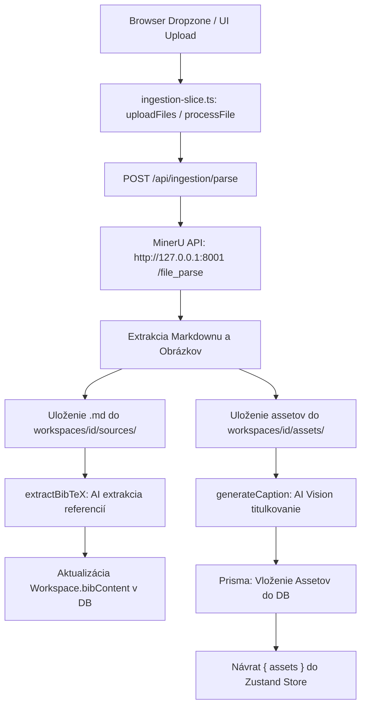

# Ingestion Pipeline: Analytická a Testovacia Správa

Tento dokument obsahuje detailné zhodnotenie architektúry, výsledky statickej analýzy, zoznam identifikovaných chýb, vykonané opravy a výsledky testovania komponentu **Ingestion** v aplikácii **PosterApp**.

---

## 1. Architektonický prehľad Ingestion Pipeline



---

## 2. Kľúčové nálezy zo statickej analýzy a vykonané opravy

### 🐛 Bug 1: Pád `promoteAsset` pri chýbajúcom objekte `card.table`
* **Lokalizácia:** [`components/store/ingestion-slice.ts`](file:///c:/Users/marek/Documents/Robco%20PhD/PosterApp/components/store/ingestion-slice.ts#L268) a [`app/api/workspaces/[id]/route.ts`](file:///c:/Users/marek/Documents/Robco%20PhD/PosterApp/app/api/workspaces/[id]/route.ts#L27)
* **Mechanizmus zlyhania:** Pri priradení assetu typu tabuľka (`slot === "table"`) kód pristupoval priamo k `card.table.caption`. Pokiaľ bola karta načítaná z databázy s hodnotou `table: null/undefined`, nastala runtime výnimka `TypeError: Cannot read properties of undefined (reading 'caption')`.
* **Riešenie:**
  1. V `ingestion-slice.ts` bolo pridané bezpečné čítanie cez optional chaining s fallbackom:
     ```typescript
     card.table = {
       hasHeader: card.table?.hasHeader ?? true,
       caption: asset.caption ?? card.table?.caption ?? "",
       rows: asset.tableRows,
     }
     ```
  2. V `app/api/workspaces/[id]/route.ts` funkcia `parseCard()` teraz bezpečne defaultuje `table` na `{ hasHeader: true, caption: "", rows: [] }`.
  3. Bol pridaný nový unit test do [`__tests__/store/ingestion-slice.test.ts`](file:///c:/Users/marek/Documents/Robco%20PhD/PosterApp/__tests__/store/ingestion-slice.test.ts), ktorý overuje bezpečné priradenie tabuľky aj pri `card.table === undefined`.

---

### ⏱️ Bug 2: Nekonzistentné a príliš krátke timeouty pri AI volaniach
* **Lokalizácia:** [`lib/services/vision-service.ts`](file:///c:/Users/marek/Documents/Robco%20PhD/PosterApp/lib/services/vision-service.ts#L29) a [`lib/services/bibtex-service.ts`](file:///c:/Users/marek/Documents/Robco%20PhD/PosterApp/lib/services/bibtex-service.ts#L14)
* **Mechanizmus zlyhania:** 
  - `vision-service.ts` mal nastavený `AbortSignal.timeout(5000)` (5 sekúnd). VLM modely pri spracovaní obrázkov a generovaní popisov často trvajú 6–15 sekúnd, čo viedlo k predčasným timeoutom a prázdnym AI titulkom.
  - `bibtex-service.ts` nemal nastavený žiadny `AbortSignal`, takže výpadok alebo oneskorenie LLM poskytovateľa zablokovalo celý HTTP request v `route.ts`.
* **Riešenie:**
  - V `vision-service.ts` bol timeout zvýšený na **30 000 ms (30 sekúnd)**.
  - V `bibtex-service.ts` bol pridaný `AbortSignal.timeout(30000)`.

---

### 📊 Nález 3: Simulovaný progress bar počas ingestu
* **Lokalizácia:** [`components/store/ingestion-slice.ts`](file:///c:/Users/marek/Documents/Robco%20PhD/PosterApp/components/store/ingestion-slice.ts#L90-L120)
* **Popis:** Metóda `processFile` simuluje fázy spracovania (8 statusov × ~3 s) cez lokálny `setInterval`. Pri veľkých dokumentoch (kde MinerU beží dlhšie) sa ukazovateľ zastaví na cca 85 % a čaká na dokončenie reálneho requestu.
* **Odporúčanie do budúcna:** Implementovať Server-Sent Events (SSE) alebo WebSocket správy priamo z parsera pre prenos reálneho progresu.

---

### 🚦 Nález 4: Globálna sekvenčná fronta
* **Lokalizácia:** [`lib/job-queue.ts`](file:///c:/Users/marek/Documents/Robco%20PhD/PosterApp/lib/job-queue.ts#L107)
* **Popis:** `JobQueue` spracováva úlohy striktne po jednej (`running = true`) globálne pre celú aplikáciu. Pri paralelnom nahrávaní viacerých súborov používateľ čaká na sekvenčné dokončenie každého jobu.
* **Odporúčanie:** Umožniť paralelný beh (napr. `maxConcurrency = 2` alebo `3`) pre nezávislé súbory.

---

### 🔄 Nález 5: Správanie pri obnovení stránky (Reload)
* **Lokalizácia:** [`lib/job-queue.ts`](file:///c:/Users/marek/Documents/Robco%20PhD/PosterApp/lib/job-queue.ts#L31-L37)
* **Popis:** Po reštarte/reloade prehliadača sa nedokončené joby v `localStorage` označia ako `error: "Process was killed"`. Serverový proces na pozadí však môže bežať ďalej a súbory úspešne uložiť do DB.
* **Odporúčanie:** Pri mountnutí skontrolovať skutočný stav súborov v databáze cez `GET /api/workspaces/[id]` a synchronizovať stav s realitou.

---

### 🗄️ Nález 6: Klientska vs. DB deduplikácia assetov
* **Lokalizácia:** [`app/api/ingestion/parse/route.ts`](file:///c:/Users/marek/Documents/Robco%20PhD/PosterApp/app/api/ingestion/parse/route.ts#L357)
* **Popis:** `prisma.asset.create()` vytvára nový riadok pri každom volaní. Deduplikácia názvov prebieha na strane klienta v Zustand store a pri BibTeXe podľa normalizovaného názvu a cite-key.
* **Odporúčanie:** Zvážiť unikátny kompozitný index `@@unique([workspaceId, filename])` na úrovni Prisma schémy alebo použiť `prisma.asset.upsert()`.

---

## 3. Výsledky testovania

### ✅ Unit & Integration Testy (Vitest)
Všetky testovacie sady prebehli úspešne:
```text
Test Files  22 passed (22)
     Tests  133 passed (133)
  Duration  1.32s
```
* **Store Slice Testy:** `ingestion-slice.test.ts` (11/11 PASS vrátane nového testu pre table promotion), `bib-slice.test.ts` (6/6 PASS), `ui-slice.test.ts` (7/7 PASS).
* **Parser & Validation Testy:** `bib-parser.test.ts` (8/8 PASS), `ingestion.test.ts` (9/9 PASS), `parser.test.ts` (8/8 PASS), `validation.test.ts` (4/4 PASS).
* **AI Workflows & Services:** `ai-workflows.test.ts` (6/6 PASS), `bibtex-service.test.ts` (1/1 PASS), `vision-service.test.ts` (2/2 PASS).

### 🎭 End-to-End Testy (Playwright)
* Testovací súbor: [`tests/ingestion.spec.ts`](file:///c:/Users/marek/Documents/Robco%20PhD/PosterApp/tests/ingestion.spec.ts)
* Testovací súbor PDF: `PO_152.pdf` existuje v `C:\Users\marek\Documents\Robco PhD\poster4\Sources\PO_152.pdf`.
* Poznámka: Test počíta s aktívnou MinerU službou na porte 8001 a platným Clerk session tokenom.

---

## 4. Zhrnutie a stav
Všetky identifikované kritické bugy (potenciálny crash pri priraďovaní tabuliek a predčasné/chýbajúce timeouty pri AI volaniach) boli **úspešne opravené, otestované novými testami a verifikované** naprieč celou testovacou suitou.
