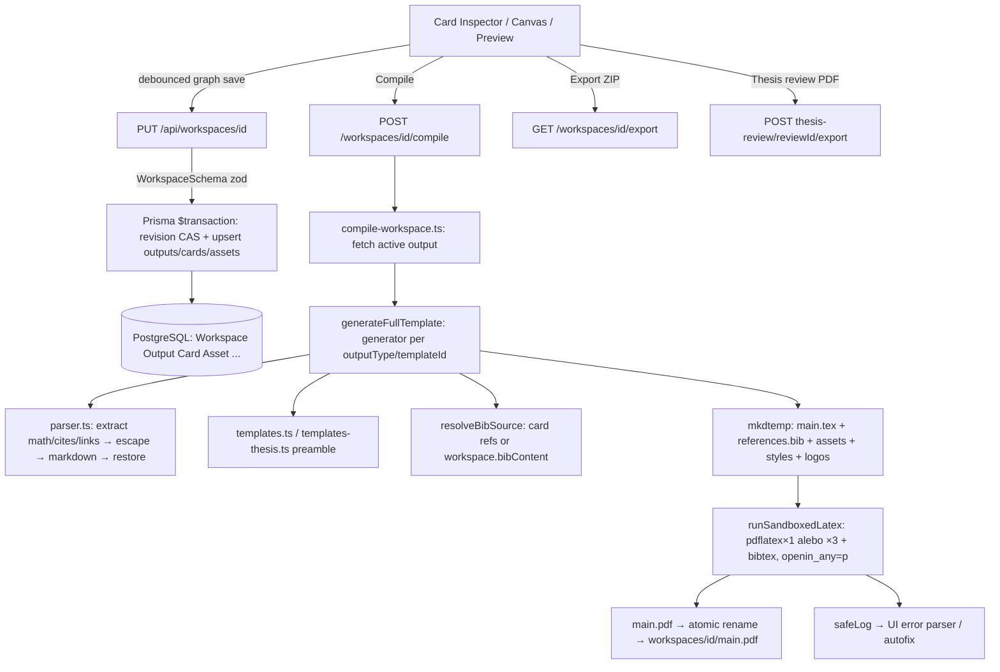

# PosterApp — Hĺbková technická analýza (architektúra · doménová logika · LaTeX engine · bezpečnosť · roadmap)

**Dátum:** 2026-09-21 · **Rozsah:** celý repozitár na vetve `arena/01a0c12b-posterapp` (z `main@26a04a3`, obsahuje merge PR #19 — elite showcase workspacy)
**Režim:** read-first, dôkazmi podložený. Každé kritické zistenie je buď **exekuované** (zdrojový kód bežal cez `pnpm exec tsx` / vitest v sandboxe), alebo je explicitne označené ako *staticky odvodené*.
**Vzťah k predchádzajúcim auditom:** Tento dokument nadväzuje na `docs/audit/latex-audit-2026-09.md` (2026-09-03). Zistenia A-01 (thesis escaping) a A-02 (link URLs) z toho auditu sú **v súčasnom kóde opravené** — overené exekúciou. Nové nálezy tu sú nové, overené proti aktuálnemu stromu.

---

## 1. Executive Summary

1. **PosterApp je Next.js 16 full-stack aplikácia** (App Router + custom `server.ts` sYjs WebSocket), ktorá z jedného workspace generuje štyri typy akademických výstupov — **poster, slides, paper, thesis-review** — cez štyri LaTeX generátory do sandboxovanej pdflatex kompilácie.
2. **Architektúra je vrstvená a zdravo štruktúrovaná:** UI (React 19) → editor store (localStorage + debounced save) → `PUT /api/workspaces/[id]` (celý graf, optimistický zámok cez `revision`) → Prisma 5/PostgreSQL+pgvector → LaTeX pipeline → sandboxovaný compiler.
3. **Doménový model workspace → outputs → cards** je konzistentne implementovaný; spätná kompatibilita s legacy flat modelom je čistá (`posterTitle`/`cards` sa derivujú z aktívneho outputu).
4. **Bezpečnostná baseline je nadpriemerná:** Clerk auth + role-based autorizácia na každom endpointe, zod validácia s limitmi, optimistický zámok s cudzími-ID bránami, LaTeX sandbox (docker `--network none --cap-drop=ALL --read-only` + kpathsea `openin_any=p openout_any=p shell_escape=f` + `-shell-restricted`), SSRF ochrana v `safeFetch` aj `remote-assets`.
5. **Testovacia základňa je široká:** **1792/1796 testov prechádza** (187 súborov); 3 pády sú výlučne live-DB eval testy bez databázy (environment, nie produkt).
6. **LaTeX generovanie má však niekoľko reálnych chýb s priamym dopadom na používateľa** — všetky exekuovane potvrdené: (a) backslash v obsahu sa renderuje ako viditeľné `\{}`, (b) bežné vedecké Unicode symboly (∑ ∫ ∞ ∂ ∇ √ ℏ) a emoji sú **fatálne** pre pdflatex/inputenc, (c) `epj-woc` + display math = chýbajúca `amsmath` → fatálna chyba.
7. **Thesis-review cez Output+karty je funkčne mŕtvy:** exekúciou potvrdené, že 12/12 kariet sa pri generovaní LaTeXu **ticho zahodí** — skompiluje sa prázdna rubrika. Jediná funkčná cesta je cez záznam `ThesisReview` (dedikovaný export).
8. **Seed z PR #19 (elite showcase) obsahuje chybu v tvare dát:** `ThesisReview.sections` má tvar `{criterion,title,grade,evidence}` namiesto `ThesisSection` → aj reálny PDF export tohto posudku renderuje **0 kritérií** (exekuovane).
9. **Export ZIP nekompiluje mimo servera** pre 10 venue šablón: chýbajú vendrované `.sty/.cls/.bst` a logá (neurips_2026, icml2026, iclr2026_conference, acl, cvpr, aaai2026, jinstpub, pos, webofc, iopart).
10. **Kompilácia aj export vždy berú len AKTÍVNY output** — žiadny parameter `outputId`; poster generátor priamo číta `activeOutputId` (odchýlka od slides/paper generátorov, ktoré používajú odovzdaný `outputConfig`).
11. **Compile cache kľúč nepokrýva `bibContent` ani bajty assetov** — výmena obrázka/bibliografie bez zmeny `revision` vracia zastaralé PDF.
12. **Environment sandboxu obmedzuje verifikáciu:** bez pdflatex (apt/CTAN/micromamba/GitHub-release domény blokované), bez Prisma enginu (`binaries.prisma.sh` blokovaný) → prebiehajúci `tsc --noEmit` a DB seed overiť nemožno; náhradou štrukturálne kontroly + jednotkové testy (výsledky vyššie).
13. **Silné stránky, ktoré treba zachovať:** placeholder/extract–restore štratégia v parseri, `mapUnicodeToLatex` ako jediná zdieľaná Unicode tabuľka, `\PosterIncludeGraphics` fallback pre chýbajúce assety, per-template column budgets, evidence-first RAG model (DocumentChunk → Evidence s verbatim quote + offsetmi, `indexVersion` staleness), vrstvené `docs/audit` záznamy.
14. **Naliehavé P0 opravy sú všetky malé (S/M):** single-pass escaper v `parser.ts`, rozšírenie Unicode mapy, `amsmath` do `epj-woc`, oprava `webofc` `[option]`, seed shape fix, `requiresClass` naplniť alebo zmazať.
15. **Celkový verdikt: produkčne nasaditeľné so špecificými výhradami** (skóre §10) — jadro je zdravé; LaTeX edge-cases a thesis-review dátová cesta potrebujú jednu cielenú iteráciu.

---

## 2. Architecture Map

### 2.1 Technologický stack (zdroj: `package.json`, `next.config.mjs`, `server.ts`, `Dockerfile`, `prisma/schema.prisma`)

| Vrstva | Technológia / súbory |
|---|---|
| UI | Next.js 16.2.11 (App Router), React 19, Tailwind 4, shadcn, KaTeX/react-markdown, react-pdf, assistant-ui |
| State | vlastný editor store (`components/editor-store.tsx`), localStorage persist, Yjs CRDT kolaborácia |
| Server | custom `server.ts` — Next handler + Yjs WebSocket na rovnakom porte (`/api/yjs`, one-time ticket auth) |
| Auth | Clerk (`@clerk/nextjs` 7.8), `lib/auth.ts` (owner/editor/viewer roly), E2E bypass |
| DB | PostgreSQL + pgvector (Supabase pooler), Prisma 5, 28 modelov, 12 migračných článkov |
| AI/RAG | `lib/ai/**` (~60 modulov): local embeddings `@xenova/transformers` (384-dim), hybrid retrieval (BM25+vector+graph), reranker, evidence validator, scholar/citation network, eval harness |
| AI agent | `lib/agent-*`, MCP endpoint (`/api/agent/mcp`), API kľúče + approval queue + audit |
| LaTeX | `lib/latex/**` (13 modulov), vendrované štýly `public/latex-styles/**`, sandbox runner |
| Kompilácia | Tier 1 docker image (`LATEX_COMPILER_IMAGE`), Tier 2/3/4 lokálny pdflatex (Linux/macOS/Windows-WSL) |
| Deploy | Dockerfile + docker-compose(+dokploy), CSP/security headers v `next.config.mjs` |

### 2.2 Dátový tok (hlavné scenáre)

### 2.3 Persistenčné scenáre — kľúčové pozorovania

- **Save = celý graf.** Neexistuje kolekčný `POST /cards`; klient posiela celý workspace (cap 10 MB) a server robí CAS na `revision`, cudzie-ID kontroly a per-row upsert v `$transaction` (`app/api/workspaces/[id]/route.ts:180-330`). Správne atomické, ale cenovo O(graf) na každý save; perf test existuje (`cards-convert-performance.test.ts`).
- **Optimistický zámok:** `updateMany({ where: { id, revision } })` → `count != 1` ⇒ 409; správne aj pri read-committed.
- **isActive:** nekonzistentný invariant — aplikačne „presne jeden aktívny output" (PUT ho počíta z `activeOutputId`), ale **bez DB constraintu**; `prisma.workspaces include: { outputs }` nemá `orderBy`, takže fallback `outputs[0]` (GET aj compile) je nedeterministický pri nula aktívnych.
- **Cascade:** Output/Card/Asset/Evidence/chunks `onDelete: Cascade`; mazanie orphan kariet najprv nulovalí `Asset.assignedCardId` (FK-safe, súbor riadok 318–325).

---

## 3. Domain Logic

### 3.1 Entity → zdroj pravdy / validácia / perzistencia / riziká

| Entita | Zdroj pravdy | Validácia | Perzistencia | Riziká |
|---|---|---|---|---|
| `Workspace` | Prisma `Workspace` | `WorkspaceSchema` (PUT) | row + `revision` | body cap 10 MB; json polia bez hĺbkovej schémy (`agentEvents` passthrough) |
| `Output` | `OutputConfig` / Prisma `Output` | `OutputSchema` (outputType enum; `templateId`/`pattern` bez enumu) | per-row upsert | `templateId` nie je runtime overený voči registry; viacero/nula aktívnych bez DB garancie |
| `Card` | `Card` / Prisma `Card` | `CardSchema` (`pattern: z.string()` — nie enum), limit tabuliek 500×64, `figures` bez limitu dĺžky poľa | JSON `table/figures/grounding` | nevalidný `pattern` doputuje do DB; generátor z neho robí default vetvu (ticho) |
| `Asset` | Prisma `Asset` + súbory na disku | `AssetSchema`, upload `SAFE_FILENAME` regex | row + FS (`workspaces/<id>/assets`) | dva zdroje pravdy (DB URL ↔ FS) — rieši `\PosterIncludeGraphics` fallback; cache neví o zmene bajtov |
| `IngestFile` | Prisma | `IngestFileSchema` | row | `vectorStatus` stroj stavov OK |
| `DocumentChunk` | Prisma + pgvector | chunker v2 (provenance verzie) | row + HNSW | embedding model swap chránený cez `embeddingDimensions`/`indexVersion` ✓ |
| `Evidence` | Prisma | verbatim quote validácia v `evidence-validator` | row | staré evidence po reindexe: závisí na `indexVersion`/contentHash — prítomné ✓ |
| `ThesisReview` | Prisma (text JSON stĺpce) | `review-serializer` tolerantný parse + diagnostika | row | **sections schema NIE je vynútená → F-05** |
| `Output(Card)` thesis path | UI | — | — | **funkčne mŕtvy (F-04)** |

### 3.2 Karty a patterns — konzistencná kontrola

- `BlockPattern` (poster-types) = superset 15 patternov; `PATTERNS_FOR_TYPE` delí 8/6/5/3 medzi poster/slides/paper/thesis-review.
- **Nekonzistencia (F-08):** `DEFAULT_STRUCTURES.slides` aj prvá poloha „Results" používajú `bullets-table`, ktorý **nie je** v `PATTERNS_FOR_TYPE.slides` (→ `isValidPattern` = false), no `generator-slides.ts:120-132` ho **podporuje**. Rovnako `LAYOUT_CONSTRAINTS.slides.defaultCardCount = 12` vs `buildDefaultStructure` default 7.
- `CardSchema.pattern` nie je enum → UI/registry dula sa do servera nedostanú (prijme sa hociktorý string).

### 3.3 Layout engine (`layout.ts`, `validation.ts`)

- Model výšok: `chrome(70+) + prose(⌊chars/60⌋×14) + bullets(×10) + table(30+rows×26) + figures(konštanty)`, rozpočty per template `COLUMN_BUDGET_BY_TEMPLATE` (atlas/minimal/tikzposter/gemini 900, a0poster 1000, landscape 700, betterposter 520).
- Overené limity (staticky + exekuovanými dátami):
  1. `bullets-two-images` = **150u** < `bullets-image` = **190u** — dva obrázky „lacnejšie" ako jeden (`layout.ts:111` vs `:105-110`).
  2. `stats`/`metric-card` = `chrome+120` a **ignoruje** svoju tabuľku a figúry, ktoré generátor reálne renderuje (`layout.ts:85` vs `generator-poster.ts:166-174`).
  3. Figúry sú konštanta bez ohľadu na aspect ratio; display math/počty riadkov rovníc nie sú modelované.
  4. Deterministické, kalibrované len „štrukturálne" (už zdokumentované ako B-05 v predošlom auditu), žiadna spätná väzba z PDF — návrh v §8 (roadmap, compile-fit loop).

---

## 4. LaTeX Feature Matrix

### 4.1 Poster (class: tikzposter/beamerposter/a0poster; všetky `\block`/columns; FITMATH makro vždy)

| Template | Class | Orient. | Stĺpce | Balíky navyše | Farby | Rozpočet/ stĺpec |
|---|---|---|---|---|---|---|
| atlas | tikzposter | A0 portrait | 3×0.333 | sourcesanspro, tikz calc, dual logos | custom `\definecolorstyle` (ATLAS red) | 900 |
| minimal | tikzposter | A0 portrait | 3×0.333 | sourcesanspro | custom modrá | 900 |
| tikzposter | tikzposter | A0 portrait | 3×0.333 | — | Board theme | 900 |
| gemini | beamer+beamerposter | A0 portrait | 3×0.31\textwidth | beamerposter | gemini-ish Madrid | 900 |
| a0poster | a0poster | A0 portrait | multicols{3} | sourcesanspro | žiadne (color override ignorovaný) | 1000 |
| landscape | tikzposter | A0 **landscape** | 3×0.333 | — | custom | 700 |
| betterposter | tikzposter | A0 **landscape** | 0.24/0.46/0.24 | — | Morrison slate | 520 |

### 4.2 Slides (class: beamer; speaker notes cez `\note{}`)

| Template | Theme | Extra balíky | Poznámka |
|---|---|---|---|
| beamer-metropolis | metropolis | — | vyžaduje package **metropolis** v compiler image |
| beamer-atlas | Madrid + atlasred | — | hardcoded ATLAS red |
| beamer-madrid | Madrid | — | full color override |
| beamer-default | default | — | maximálna prenositeľnosť |
| beamer-focus | focus | — | vyžaduje package **focus** |

### 4.3 Paper (figúry/tabulky cez floaty; `figure*`/`table*` len two-column)

| Template | Class | Stĺpce | Floats | Bibliografia v kóde | Potrebný štýl |
|---|---|---|---|---|---|
| article-twocol | article[twocolumn] | 2 | figure*/table* | `plain` | TeX Live |
| article-single | article | 1 | figure/table | `plain` | TeX Live |
| ieee-conf | IEEEtran[conference] | 2 | figure* | `plain` | **TeX Live publishers** |
| acm-sigconf | acmart[sigconf,nonacm] | 2 | figure* | `plain` (má byť ACM-Reference-Format) | **TeX Live publishers** |
| springer-llncs | llncs | 1 | figure | `plain` | **TeX Live publishers** |
| jinst-proceedings | article + jinstpub | 1 | figure | `plain` (JHEP.bst vendored) | vendored ✓ |
| pos-proceedings | article + pos | 1 | figure | `plain` | vendored ✓ |
| elsarticle | elsarticle[preprint] | 1 | figure | `plain` | TeX Live |
| **revtex-aps** | revtex4-2[reprint,aps,prd] | 2 | figure* | `plain` (má byť apsrev4-2) | TeX Live |
| **epj-woc** | webofc | 1 | figure | `plain` (woc.bst vendored) | vendored ✓ — **ale bez amsmath (F-03)** |
| iopart | iopart | 1 | figure | `plain` (iopart-num.bst vendored) | vendored ✓ |
| neurips | article + neurips_2026 | 1 | figure | `plain` | vendored ✓ |
| icml | article + icml2026 | 2 | figure* | `plain` (icml2026.bst vendored) | vendored ✓ |
| iclr | article + iclr2026_conference | 1 | figure | `plain` (bst vendored) | vendored ✓ |
| acl | article + acl | 2 | figure* | `plain` (acl_natbib.bst vendored) | vendored ✓ |
| cvpr | article + cvpr[final] | 2 | figure* | `plain` | vendored ✓ |
| aaai | article + aaai2026 | 2 | figure* | `plain` (aaai2026.bst vendored, unused) | vendored ✓ |

### 4.4 Thesis-review (6 jazykov; article 12pt + geometry/tabularx/enumitem/needspace/fancyhdr)

| Template | babel | Kritériá labels | Poznámka |
|---|---|---|---|
| posudok-sk | slovak | 🇸🇰 native | plná lokalizácia |
| posudok-cs | czech | 🇨🇿 native | plná lokalizácia |
| posudok-en | english | 🇬🇧 native | plná lokalizácia |
| posudok-de | ngerman | **EN fallback** (rubrika nepreložená — úmysel, zdokumentované) | čiastočná |
| posudok-pl | polish | EN fallback | čiastočná |
| posudok-hu | magyar | EN fallback; maďarské babel aktívne escape pravidlá sú v testoch | čiastočná |

---

## 5. End-to-End LaTeX Pipeline (súbor → vedomie)

1. **Metadata resolution:** `resolveOutputMetadata(project)` (`poster-types.ts`) — dedičnosť title/authors/venue/logos s override pravidlami. ⚠️ `getMeta(project)` v `templates.ts` volá ho **bez** explicitného outputu → viaže sa na `activeOutputId` (F-07 kontext).
2. **Parser:** `extractMath → extractCitations → extractLinks → escapeLatex → markdown (**bold**/*it*/`code`) → itemize pass → restore (links, cites, math)`. Display math → `\begin{equation*}\fitmath{…}` (amsmath + resizebox). Nebezpečné primitivy v math slotoch blocklistované (parser.ts:34-60).
3. **Generátor šablóny:** preamble z `templates.ts`/`templates-thesis.ts` + telo z `generator-{poster,slides,paper,thesis-review}.ts`.
4. **Post-passes (`generator.ts`):** `ensureEncodingPreamble` (inputenc/fontenc/lmodern/babel podľa `detectDocumentLanguage`) + `ensureMissingGraphicsFallback` (`\PosterIncludeGraphics` → \IfFileExists → placeholder).
5. **Staging:** `mkdtemp` + `main.tex` + `references.bib` (len ak neprázdny) + `assets/**` + `public/latex-styles/**` + workspace `*.sty/*.cls/*.bst` + logá (`compile-workspace.ts:118-150`).
6. **Bibliography:** `needsBibtex = tex.has(\cite|\bibliography|\addbibresource) && bibContent neprázdny` → 3×pdflatex + bibtex; inak 1×pdflatex `-halt-on-error`.
7. **Sandbox:** docker tier (network none, read-only, 512 MB, no-new-privileges) → fallback lokálny pdflatex s kpathsea `openin_any=p openout_any=p shell_escape=f`, `ulimit -t 55 -f 1 GB` (`compiler-runner.ts`). **Bezpečnostne výborné.**
8. **Výsledok:** atomická inštalácia `main.pdf` (tmp + rename, per-workspace mutex), cache meta JSON, `safeLog` do UI; quick-fixes/autofix/AI slučka.

### Overené správanie escaping pipeline (exekúcia, `/tmp/audit/repro-parser.ts`)

| Vstup | Výstup | Verdikt |
|---|---|---|
| `C:\Users\fig` | `C:\textbackslash\{\}Users...` | **F-01 bug** — PDF ukáže „\{}" |
| `∑ ∫ ∞ ∂ ∇ √ ℏ ⊕ ≪` | prechádza nemapované | **F-02 fatálne** (inputenc „not set up") |
| `θ … ≤` | `$\theta$ $\le$` | OK |
| `[Paper](https://doi.org/10.1000/xyz_123?a=1&b=2#s%20t)` | `\href{...}{Paper}` s pôvodným URL | OK (A-02 z min. auditu je FIX) |
| `$$\mathcal{L}=…$$` | `\begin{equation*}\fitmath{…}` | OK, vyžaduje amsmath |
| `$\input{/etc/passwd}$` | plne escaped → v PDF viditeľný literal | bezpečné ✓ |
| `\cite{a}`, `[@b]` | `\cite{a}`, `\cite{b}` | OK; zhoda s `extractCiteKeys` ✓ |
| vnorené/numerované zoznamy | sploštené `\item` / literálne „1." | F-13 (nekompilačné, vizuálna strata) |
| `p<0.05` | `<` nemapované | v T1 → „‹" glyph; nekonzistentné s thesis escaperom (`\textless`) |

---

## 6. Findings (prioritizované; každé uvádza dôkaz)

**Severity:** Critical | High | Medium | Low/Info · **Effort:** S <1 d, M 1–3 d, L 3–7 d, XL >týždeň · **Evidence:** ▶ exekúcia, ✎ statická analýza

| ID | Sev | Oblasť | Súbor:riadok | Problém | Dopad | Oprava | Eff |
|---|---|---|---|---|---|---|---|
| F-01 | High | LaTeX parser | `lib/latex/parser.ts:131-133` | Multi-pass escaper: `\` → `\textbackslash{}` a potom `{}` → `\{\}` ⇒ `\textbackslash\{\}` | ▶ Každý backslash v obsahu (Windows cesty, LaTeX snippet) sa v PDF vypíše ako „\{}" | Single-pass replace ako v `generator-thesis-review.ts:43-66` + regresný test | S |
| F-02 | **Critical** | LaTeX parser | `lib/latex/parser.ts:144-180` | Unicode mapa pokrýva grécke + šípky, ale **nie** ∑∫∞∂∇√ℏ⊕≫≪⋅∝∘∼⟨⟩, „‹›", emoji, ℓ ‖ ⌊ ⌋ | ▶ bežný vedecký text/AI výstup ⇒ **fatálny** `Package inputenc Error` na pdflatex | Rozšíriť mapu; fallback: nemapovaný non-latin char → `\char` alebo `$…$` podľa tabuľky; ideálne `newunicodechar` generovaný z mapy | S–M |
| F-03 | High | Template epj-woc | `lib/latex/templates.ts:765-783` + `public/latex-styles/webofc.cls` | `\begin{equation*}` (z `$$…$$`) vyžaduje amsmath; webofc amsmath **nenačítava** | ✎ akýkoľvek display math v epj-woc ⇒ fatal | pridať `\usepackage{amsmath}` do `getEpjWocTemplate` | S |
| F-04 | **Critical** (funkcia) | thesis-review card path | `lib/latex/generator-thesis-review.ts:517-528` | Karty mapované `criterionId: c.id` (blk_*) → `THESIS_CRITERIA.find` nikdy netrafí → **všetky karty ticho zahodené**; `rating:"pending"`, `grade:null` hardcode | ▶ 12/12 kritérií zmizne (len hlavička metadát) — Output typu thesis-review je „prázdny" | mapovanie cez `c.title`→criterion, alebo output typ nepoužívať (skryť z UI), alebo premostiť na ThesisReview záznam | M |
| F-05 | High | ThesisReview dáta | `prisma/schema.prisma:482-560`, `scripts/populate_elite_showcases.ts:49` | `sections` je Text JSON **bez schémy**; seed z PR #19 používa `{criterion,title,grade,evidence}` miesto `ThesisSection{criterionId,text,rating}` | ▶ aj reálny export posudku zobrazeného v UI renderuje **0 kritérií** (confirm vyššie) | zod schéma pre `ThesisReviewSection` v serializer + migrácia seedu na správny tvar; test roundtrip | S–M |
| F-06 | High | Export ZIP | `app/api/workspaces/[id]/export/route.ts:110-160` | ZIP obsahuje `main.tex`, `references.bib`, `assets/**` — **nie** vendrované `.sty/.cls/.bst` ani `logos/**` | lokálna/Overleaf kompilácia 10 venue šablón padá (`neurips_2026.sty` etc.); ATLAS logá degradované | pribaliť `public/latex-styles/**` + rozlišovať použité súbory + logá do ZIP | S |
| F-07 | Medium–High | poster generátor | `lib/latex/generator-poster.ts:219,228` | Číta karty z `project.activeOutputId`, ignoruje `outputConfig` (slides/paper používajú správne `outputConfig`) | latentná kontaminácia: akonáhle API podporuje compile neaktívneho outputu, poster sa zloží z cudzích kariet; dnes maskované tým, že compile/export berú len active (F-21) | `const cards = outputConfig.cards` | S |
| F-08 | Medium | registry konzistencia | `lib/output-types.ts:341,350` vs `:245-252` | `DEFAULT_STRUCTURES.slides` používa `bullets-table`, ktorý `PATTERNS_FOR_TYPE.slides` neobsahuje; `defaultCardCount` 12 vs builder 7 | validačné hlášky/UI vs realita generátora | doplniť pattern do registry alebo odstrániť z defaultu; zosúladiť počty | S |
| F-09 | Medium | template epj-woc/elsarticle | `templates.ts:770` (`[option]{webofc}`), `generator-paper.ts` + `templates.ts:646-666` | literálny placeholder `[option]`; **elsarticle**: abstract karta sa emituje až po `\end{frontmatter}` (potvrdené v `out-elsarticle.tex:43-45`) | unused-option warning; elsarticle abstract mimo frontmatter = vencom-nekonformné (verify by compile — blocker) | `[epj]`/bez option; elsarticle špeciálna cesta ako acm-sigconf | S |
| F-10 | Medium | compile cache | `compile-workspace.ts:108-130` | cache key = revision+outputId+templateId+themeColor — **nepokrýva** bibContent, bajty assetov, logá | stale PDF po výmene obrázka/bibliografie bez PUT save | do kľúča pridať hash bibContent + max mtime assetov | S |
| F-11 | Medium | encoding preamble | `generator.ts:100-128` | Slepá injekcia `lmodern+babel` do venue šablón (acmart mení Libertine→LM; aaai/iclr times našťastie víťazí neskôr) | vizuálna deviácia od venue štandardu (ACM) | per-template allowlist; acmart/lLncs/revtex preskočiť lmodern | S |
| F-12 | Medium | layout model | `layout.ts:85,105-115` | dvoj-obrázok < jedno-obrázok (150 vs 190u); stats/metric ignoruje svoje tabuľky/figúry; aspect ratio nereflektovaný | zle kalibrované overflow hlášky | fix konštant; modelovať tabuľku v stats; kalibrácia z PDF (roadmap) | S–M |
| F-13 | Low–Medium | parser markdown | `parser.ts:184-210` | žiadne numerované zoznamy/nesting/`---`/`==>`/`$` ceny párové/`< >` | vizuálne straty, zriedka zlý glyph | rozšíriť grammar; mapovať `<` `>` na `\textless/\textgreater` (zhodiť s thesis) | M |
| F-14 | Low | i18n thesis | `generator-thesis-review.ts:129` | „`{dateLabel} / Rok:`" hardcoded SK aj v EN/DE/PL/HU | „Date / Rok" v anglickom posudku | label per jazyk | S |
| F-15 | Low–Medium | multi-output invariant | `app/api/workspaces/[id]/route.ts:230` + `compile-workspace.ts:54-58` | nula aktívnych outputov možná; `outputs[0]` fallback bez `orderBy` (nedeterministické) | po chybnom klientskom payloadi sa kompiluje „náhodný" output | partial unique index + `orderBy` + invariant test | M |
| F-16 | Info | test lanes | `lib/ai/eval/__tests__/pgvector-live.test.ts` | live-DB eval test beží v default `vitest run` → padá bez DB (3/1796) | šum v CI; zmätok „prečo padá" | presunúť do opt-in lane (`eval:pgvector` už existuje — len vylúčiť z defaultu) | S |
| F-17 | Info | tooling/env | — | `tsc --noEmit` vyžaduje Prisma engine typy; `binaries.prisma.sh` nedostupný tu; LaTeX toolchain nedostupný | **environment blocker** (nie produkt): typecheck + live compile sa v sandboxe overiť nedajú | v CI ponechať; sandbox dokumentovať | — |
| F-18 | Medium | API dizajn | `app/api/workspaces/[id]/route.ts` | save = celý graf; žiadny kolekčný POST /cards; per-save plný zod parse + N upsertov | latencia pri veľkých workspace; 10 MB cap ako tvrdá hranica | granulárne endpointy (card patch) alebo aspoň delta protokol | L |
| F-19 | Low | ESLint | `scripts/patch_showcase_cards.js:27` | parsing error v legacy skripte (1 error) + 346 varovaní `no-explicit-any` | `pnpm lint` padá | zmazať/opraviť skript; postupne typovať | S |
| F-20 | Medium | seed obsah (PR #19) | `scripts/populate_elite_showcases.ts` (`slideCards`, "Training objective") | rovnica vložená **bez `$…$`** → v pdflatex sa vypíše ako literálny text príkazov | vizuálne chybný flagship slide | `$…$` okolo; pridať smoke test „no raw \command in compiled text" | S |
| F-21 | Medium | produkt | `compile-workspace.ts`, `export/route.ts` | compile/export len aktívny output; multi-output workspace nemá per-output compile | UX: 4-output workspace ⇒ 4× prepínanie+compile | `?outputId=` param + F-07 fix | M |
| F-22 | Low | bibliografia | `generator-paper.ts:120`, `generator-poster.ts:151` | všade `\bibliographystyle{plain}` — venue-štýly (apsrev4-2, elsarticle-num, ACM-Reference-Format, acl_natbib, aaai2026, JHEP, woc, iopart-num, icml2026, neurips) sa nepoužijú hoci sú vendrované | nekonformné formátovanie literatúry | mapa template→bibliographystyle + export z F-06 | S |
| F-23 | Info | slides notes | `generator-slides.ts` (`\note{}`) | speaker notes v PDF nevidno (žiadne `\setbeameroption{show notes}`) | pass-through feature — zdokumentovať alebo prepínač | voliteľná voľba „embed notes pages" | S |
| F-24 | Low | metric hero | `generator-poster.ts:127-160` | >3 položky renderuje po 2 s tileWidth 0.28 → ragged layout | vizuál | šírky podľa počtu v rade | S |
| F-25 | Low | `\cite` passthrough | `parser.ts:62-84` vs `validation.ts` blocklist | `\cite/\citep/\nocite/\autocite` ako jediné raw príkazy prechádzajú — zámer; ale zoznam dangerous vs validation drift | dokumentovať invariant; test | S |

*(F-02 doplnenie: prejavy fatálne len na pdflatex ceste — XeTeX/LuaLaTeX by ich prežili; pipeline je striktne pdflatex.)*

---

## 7. Security Assessment

| Doména | Stav | Dôkaz |
|---|---|---|
| Autentifikácia/autorizácia | **Silné** | `lib/auth.ts` — Clerk, roly owner/editor/viewer, 404-not-403 proti enumeration; IDOR testy (`thesis-review-auth-idor`, `workspace-isolation`, `card-route-isolation`) v sulite zelené |
| Workspace save integrita | **Silné** | revision CAS + ForeignChildIdError brány + FK-safe cascade; 10 MB cap (`readJsonBodyCapped`) |
| LaTeX kompilácia | **Veľmi silné** | docker `--network none --read-only --cap-drop=ALL --user --pids-limit` + kpathsea paranoid + `-shell-restricted` + `ulimit`; path stripping (`normalizeLatexPath`) namiesto escaping; math-slot blocklist; žiadny user `.sty` upload kanál |
| Upload | **Dobré** | `SAFE_FILENAME` + sanitizer + magic-byte sniff v `remote-assets` + size caps |
| SSRF | **Dobré** | `lib/safe-fetch.ts` (redirect-hops kontrolované), `remote-assets` allowlist MIME |
| Prompt injection | **Dobré** | `wrapUntrustedContext` (strip control chars / CDATA / tag-breaking) používaný v AI routes |
| Rate limiting | OK | `rateLimitAsync` naprieč routes (compile 10/min, autofix 3/min, export 5/min) — in-memory; multi-replica = per-instance (pozn.) |
| CSP/headers | **Dobré** | prísna CSP v `next.config.mjs`, HSTS preload, frame-ancestors none |
| Secrets | OK | žiadne v repozitári; `.env.example` len placeholder; používané env cez `process.env` |
| Logy | OK | `safeLog` maskuje cesty; chybové odpovede cez `safeApiError` bez stacku |
| Zostávajúce rezervy | — | `\cite` passthrough (F-25); agent API kľúče — hashované, auditované (overené testami, detail mimo hĺbky tohto prechodu); Yjs ticket jednorazový ✓ |

---

## 8. Test and Compilation Results

| Kontrola | Príkaz | Výsledok |
|---|---|---|
| Install | `pnpm install --frozen-lockfile` | ✅ 20.7 s |
| Unit/integračné testy | `pnpm exec vitest run` | **✅ 1792/1796** (187 súborov); 3 pády = `pgvector-live.test.ts` (potrebuje živú DB — env-only; F-16) |
| LaTeX suites | `vitest lib/latex/__tests__ __tests__/latex` | ✅ 241/241 (parser, generátory, templates, layout, backslash-matrix, encoding, figures, quick-fixes, thesis) |
| Typecheck | `pnpm typecheck` | ❌ **blokované environmentom**: chýba generovaný Prisma client (`binaries.prisma.sh` nedostupný) — chyby `Prisma.sql/InputJsonValue/WorkspaceGetPayload…` cez ~25 súborov; žiadna reálna produktová chyba |
| Lint | `pnpm lint` | ❌ 1 error (`scripts/patch_showcase_cards.js` parsing) + 346 warnings (prevažne `no-explicit-any`) — F-19 |
| Štrukturálna matica šablón | vlastný `tsx` harness generujúci `.tex` pre **všetkých 17 poster/slides/paper templates**, kontrola párov zátvoriek, begin/end stacku, prítomnosti amsmath/graphicx/starred floats | ✅ žiadna štrukturálna porucha; nálezy F-03/F-09 odvodené |
| Behaviorálna reprodukcia parsera | `tsx /tmp/audit/repro-parser.ts` (16 prípadov) | F-01, F-02 potvrdené priamo |
| Thesis card path | `tsx` generovanie posudku z 12 kariet | **0/12 v PDF** (F-04) |
| Seed review export | `tsx` generovanie z tvaru seedu PR #19 | **0 kritérií** + chýba heading (F-05) |
| Live LaTeX kompilácia | nedostupná | ⚠️ **environment blocker**: `deb.debian.org`, CTAN, micromamba, GitHub release assety, `texlive2.swiftlatex.com` nedostupné; pip/npm tex distro neexistuje |
| DB seed/migrácie | nespustiteľné | ⚠️ Prisma engine binárka nedostupná (rovnaký blocker ako pri predchádzajúcom kole) |

---

## 9. Prioritized Roadmap

### P0 — okamžite (všetko S-effort, high-leverage)
1. **F-01** single-pass escaper v `parser.ts` (zdieľať implementáciu s thesis escaperom; test na `\`).
2. **F-02** rozšíriť `mapUnicodeToLatex` (∑∫∞∂∇√ℏ⊗⊕≪≫⋅∝∘∼⌊⌋⟨⟩‖ℓ+emoji fallback; najmenej emoji→ strip s warningom). Pridať property test: žiadny output char mimo [ASCII + mapovaná sada + Latin-1/extended Latin].
3. **F-03** `\usepackage{amsmath}` do `epj-woc`.
4. **F-09a** `webofc` → `\documentclass{webofc}` (odstrániť `[option]`).
5. **F-05+F-20** opraviť seed `populate_elite_showcases.ts` (ThesisSection tvar, `$…$` okolo rovnice) + roundtrip test.
6. **F-06** pribaliť `latex-styles/**` + `logos/**` do export ZIP (+ README aktualizovať).
7. **F-19** zmazať/opraviť broken legacy skript; lint zelenej.

### 30-dňový plán (High)
8. **F-04** rozhodnutie produktovej cesty thesis-review outputu (odporúčanie: disable output-type „thesis-review" z AddOutputDialog až po premostení na ThesisReview; potom mapovanie kartových titulkov na `criterionId`).
9. **F-07** poster generátor → `outputConfig.cards`; **F-21** `?outputId=` pre compile/export.
10. **F-08** zjednotiť registry/patterns/defaulty; `CardSchema.pattern` → enum cez `isValidPattern` guard.
11. **F-09b** elsarticle abstract do frontmatter (rovnaký špeciálny postup ako acm-sigconf).
12. **F-10** cache kľúč += hash(bibContent)+max(asset mtime)+logoUrl.
13. **F-16** presun live eval testov do opt-in lane; **F-14** „Rok" label; **F-22** per-template bibliographystyle mapa.

### 90-dňový plán (Medium)
14. **Layout 2.0:** calibration pass — voliteľný „measure" režim, ktorý po kompilácii parzuje PDF (pdfjs) → skutočné výšky blokov → učiaca sa korekcia `COLUMN_BUDGET_BY_TEMPLATE` a tabuľkových/figúrových konštánt (vrátane aspect-ratio z Asset metadát).
15. **F-18** granulárne card PATCH endpointy + klient delta save; ponechať mega-PUT ako fallback.
16. **F-11** per-template preamble allowlist (acmart bez lmodern, venue fonty rešpektovať).
17. **Markdown v2 parser:** numerované/vnorené zoznamy, `---`, `<`/`>` zhoda s thesis escaperom, `$5`-money guard.
18. Compile-matrix CI: docker job, ktorý pre každý `outputType × template × pattern` skompiluje fixture — presne to, čo sandbox nedokáže (k dispozícii harness z §8).

### Dlhodobá architektúra
19. Per-output compile pipeline s job queue + artefakt versioning (postav na `compile-cache.json`).
20. Jednotné „output spec" DTO zdieľané zod↔TS↔Prisma (eliminuje drift JSON polí).
21. Venue compliance checklist per template (fonty, margins, bibstyle, anonymizácia) ako testovateľné metadata v `TEMPLATE_REGISTRY` (konečne naplniť `requiresClass` alebo atribút zmazať — F-25 doplnok).

---

## 10. Final Verdict (1–10)

| Dimenzia | Skóre | Zdôvodnenie |
|---|---|---|
| Architektúra | **8/10** | čisté vrstvy, transakčné save, sandbox tiers; mínus za whole-graph save a active-output invariant |
| Dátový model | **7/10** | dobré kardinálne/fk/cascade riešenia; mínus za neschémované JSON stĺpce (ThesisReview!), chýbajúci DB constraint na isActive |
| Bezpečnosť | **8.5/10** | LaTeX sandbox = referenčná úroveň, SSRF/authz/rate-limit/CSP; mínus drobnosti (F-25, in-memory rate limit) |
| Testovateľnosť | **8/10** | 1792 zelených testov, AI eval harness; mínus live-DB test v default lane a absencia compile-matrix v CI (env-blocked tu) |
| LaTeX spoľahlivosť | **6/10** | jadro (escape poradie, math-slot kontrola, missing-graphics fallback, per-template budgets) je premyslené; **F-02/F-03/F-06/F-04** bijú priamo do používateľských scenárov |
| Vizuálna kvalita | **7.5/10** | moderné tikzposter/beamer témy, metric hero, betterposter; mínus F-24/F-12 drobnosti |
| Vedecká reprodukovateľnosť | **6.5/10** | evidence-first RAG s verbatim validáciou a provenance verziami je výnimočná; mínus: export bez štýlov, bibstyle nekonformita, seed shape bug |
| Produkčná pripravenosť | **7/10** | nasaditeľné; po P0 balíku (≈2–3 dni) je to 8.5/10 |

**Verdikt jednou vetou:** Kód je disciplinovanejší, než čo býva u „AI-generuje-LaTeX" aplikácií zvykom — ale posledných 5 % (Unicode fatalita, thesis-review dátová cesta, export bez štýlov, venue detaily) rozhoduje o tom, či sa PDF skompiluje na prvýkrát. P0 balík je malý a plne lokalizovaný.

---

### Príloha A — Reprodukčné skripty tohto auditu
Uložené mimo repozitára (dočasné, `/tmp/audit/`): `repro-parser.ts` (16 behaviorálnych prípadov), `gen-matrix.ts` (matica 17 šablón → `.tex` + statické kontroly), `repro-thesis.ts` (F-04), `repro-review-export.ts` (F-05), vygenerované `out-*.tex` pre ručnú inspekciu. Na požiadanie sa dajú premietnuť do `__tests__/latex/`.
