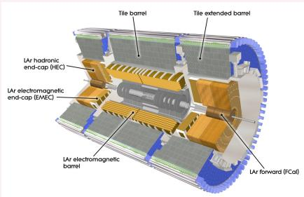
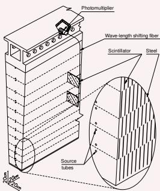
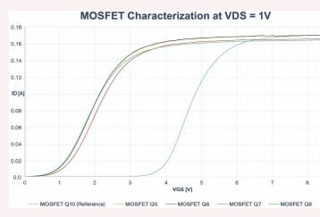
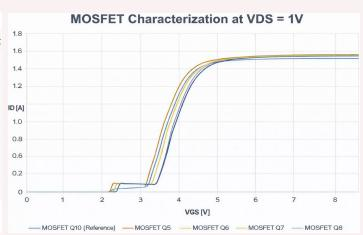
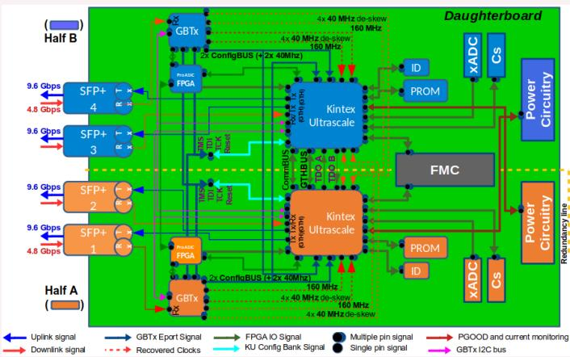
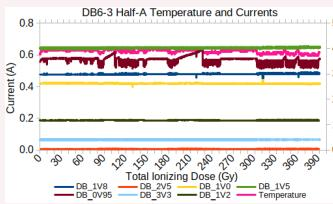
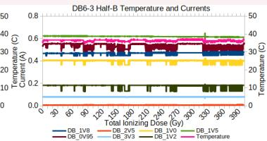

## The ATLAS Hadronic Tile Calorimeter (TileCal)

• The Tile Calorimeter is a hadronic calorimeter composed of wedge-shaped modules arranged in a Long Barrel (LB) and two Extended Barrels (EB).

• Consists of 256 modules containing 5182 calorimetric cells, utilizing scintillating tiles and wavelength shifting fibers to transfer light to photomultiplier tubes (PMTs). Most cells are readout by two PMTs, except for special E1–E4 gap/crack cells readout by one PMT.

• Low Voltage Power Supplies (LVPS): Utilize switching DC-DC converters (bricks) at 300 kHz to step down a bulk 200 V input to diferent voltage levels to distribute stable power to the on-detector readout electronics.

• Daughterboard (DB): central communication hub of each module, using high-speed optical links to continuously transmit digitized PMT signals to of-detector systems while receiving timing and configuration commands.

• Components located in the highest radiation regions of TileCal, particularly the LB LVPS and readout electronics close to the detector gap regions, must tolerate elevated TID and NIEL levels.

• Single Event Efects (SEE), in particular Single Event Upsets (SEU) and Single Event Latch-ups (SEL), must be evaluated and mitigated.

  
Figure 1: ATLAS Tile Calorimeter (left) and a wedge-shaped module slice (right) [1].

## Radiation Criteria

• Simulated radiation criteria for the HL-LHC includes safety factors up to 5.0 for TID (low dose rate) and 2.0 for SEE.

<table><tr><td rowspan="2">Component</td><td colspan="3">Dose, fitted in region of max</td></tr><tr><td>TID [Gy]</td><td>NIEL [n/cm2]</td><td>SEE [p/cm2]</td></tr><tr><td>PMT Divider - Barrel</td><td>17.6</td><td> $2.0 \times 10^{12}$ </td><td> $1.9 \times 10^{11}$ </td></tr><tr><td>FENICS - Barrel</td><td>10.6</td><td> $1.6 \times 10^{12}$ </td><td> $1.8 \times 10^{11}$ </td></tr><tr><td>MB - Barrel</td><td>10.0</td><td> $1.4 \times 10^{12}$ </td><td> $9.2 \times 10^{10}$ </td></tr><tr><td>LVPS - Barrel</td><td>53.6</td><td> $3.5 \times 10^{12}$ </td><td> $5.3 \times 10^{11}$ </td></tr><tr><td>DB - Endcap</td><td>6.8</td><td> $9.7 \times 10^{11}$ </td><td> $4.9 \times 10^{10}$ </td></tr></table>

Table 1: Simulated worst-case doses for 4000 fb−1 (no safety factors), only higher doses from Barrel/Endcap are shown.

## LVPS Design & Component Radiation Testing

• LVPS Design: 8 identical bricks for LB modules and 6 bricks for EB modules inside a box convert the 200 V input to a 10 V output at a nominal power of 23 W - Each brick powers an independent side of the readout electronics, preserving the TileCal dual-PMT cell redundancy.

• Replacing original STB57N65M5 power MOSFETs with SIHFS9N60A reduced gate-source capacitance and switching losses. Eficiency improved from 58% to 72%, meeting the 77 kW cooling capacity of the TileCal cooling system.

• Control interface optimization reduced the number of required control lines by 50%, enabling reuse of the existing infrastructure. The optimization successfully achieved the project targets, ensuring operational stability and mitigating failure risks.

• Radiation Testing: SIHFS9N60A MOSFET (main high-power switching transistor): Shift of 2.5 V in gatesource threshold observed after 200 Gy of TID, with minimal deviation from NIEL.

• SI8920 Isolation Amplifier (safe analog signal isolation for over-voltage protection): Initial tests showed voltage fluctuations at 150 mV, but performance is completely stable below 100 mV. It has been selected for final production with circuits restricting the input voltage.

• LT1681 Controller (feedback loop & switching pulse generator) & LT3080 Regulator (maintains stable local voltages): TID tests at 502 Gy/h showed minor drifts (≤ 5%) in output voltages, within acceptable limits.

• LTC6241 Op-Amp (signal conditioning): Single Event Transients (SETs) had small amplitudes (≈50 mV) and short durations (≈100 ns) posing no efect on brick performance.

<table><tr><td>Component</td><td>Flux [p/cm $^{2}$ /s]</td><td>Fluence [p/cm $^{2}$ ]</td><td>SEE Count</td><td>Cross Section [cm $^{2}$ ]</td></tr><tr><td>LT1681</td><td> $2.4 \times 10^{8}$ </td><td> $7.05 \times 10^{11}$ </td><td>64 (2 chips)</td><td> $4.54 \times 10^{-11}$ </td></tr><tr><td>LTC6241</td><td> $2.4 \times 10^{8}$ </td><td> $7.05 \times 10^{11}$ </td><td>133 (4 op-amps)</td><td> $4.72 \times 10^{-11}$ </td></tr><tr><td>LT3080</td><td> $2.4 \times 10^{8}$ </td><td> $7.05 \times 10^{11}$ </td><td>198 (4 chips)</td><td> $7.02 \times 10^{-11}$ </td></tr><tr><td>IR2110</td><td> $3.5 \times 10^{8}$ </td><td> $3.4 \times 10^{11}$ </td><td>None (2 chips)</td><td> $>1.47 \times 10^{-12}$ </td></tr><tr><td>SIHFS9N60A</td><td> $3.5 \times 10^{8}$ </td><td> $3.4 \times 10^{11}$ </td><td>None (8 chips)</td><td> $>3.67 \times 10^{-13}$ </td></tr><tr><td>SI8920</td><td> $1 \times 10^{7}$ </td><td> $1.96 \times 10^{11}$ </td><td>1 (20 chips)</td><td> $2.55 \times 10^{-13}$ </td></tr></table>

Table 2: Summary of SEE tests conditions and results for diferent components [3].

  
TID (left) and after NIEL tests (right) [3].  
Figure 2: SIHFS9N60A MOSFET characterization at VDS = 1 V after 200 Gy of

## Daughterboard (DB) Architecture

• Interfaces the on-detector and of-detector systems by distributing timing and configuration signals and continuously transmitting digitized PMT data of-detector.

• 896 DBs will transmit ∼35 Tbps of physics data via 3584 optical uplinks (9.6 Gbps), while receiving configuration and timing via 1792 downlinks (4.8 Gbps).

• Utilizes Commercial Of-The-Shelf components and radiation-hard GBTx ASICs (receive clock and config commands) designed by CERN.

  
Figure 3: The TileCal Daughterboard redundancy architecture and data paths [5].

## DB Radiation Qualification & Tolerances

• The DB requires 108 Gy TID and 13.16 × 1012 n/cm2 NIEL qualification limits (including SFs).

• Kintex Ultrascale (KU) FPGAs (primary data processors) and ProASIC FPGAs (remote reconfiguration bufers) successfully withstood over 108 Gy and 14 × 1012 n/cm2 during tests.

• KU+ FPGAs were disqualified for exhibiting SEL; selected KU FPGAs showed no SEL up to 3.2×1011 p/cm2.

• Measured SEU rates for the KU FPGA were 116 SEU/(109 p/cm2); ≈5498 SEUs per year, heavily mitigated by Xilinx SEM.

  
Figure 4: Monitored KU FPGA temperatures and currents during 54 MeV proton beam TID testing. Drops correspond to active SEU corrections by the Xilinx SEM and resets applied during uncorrectable SEUs [5].

## Conclusions

The optimized power distribution scheme increases readout reliability, power eficiency, and mitigates failure impact by utilizing identical and independent LVPS bricks.

• DB key components passed TID and NIEL qualification, and SEL was eliminated from the selected KU FPGAs.

• All critical components for the upgrade of the TileCal on-detector electronics have been successfully qualified against the expected radiation environment, following all the safety factors imposed by CERN guidelines, enabling full-scale production.

## References

1. ATLAS Collaboration, The ATLAS Experiment at the CERN Large Hadron Collider, JINST3 (2008)S08003, https://doi.org/10.1088/1748-0221/3/08/S08003

2. ATLAS collaboration, Technical Design Report for the Phase-II Upgrade of the ATLAS Tile Calorimeter, CERN-LHCC-2017-019, 2017. https://cds.cern.ch/record/2285583/files/CERNLHCC-2017-019.pdf

3. S. Moayedi, Upgrade of the ATLAS Tile Calorimeter front-end power supply for the HL-LHC, 2026 JINST 21 C05002.

4. S. Moayedi, Upgrade of the ATLAS Tile Calorimeter Front-End Power Supply for the HL LHC, ATL-TILECAL-SLIDE-2025-552.

5. E. Vald´es Santurio et al., Radiation studies performed on the High Luminosity ATLAS Tile-Cal link Daughterboard, 2023 JINST 18 C04011.