Eye diagram of the uplinks

# Operations and Performance of the ATLAS Tile Calorimeter Phase-II Upgrade Demonstrator in Run 3 Fernando Carrió Argos\* on behalf of ATLAS Tile Calorimeter system \*Instituto de Física Corpuscular (CSIC-UV)

## Central part of the ATLAS hadronic calorimeter

☐ Measurement of jet energies, hadronically decaying $\tau$ leptons and missing transverse energy

☐ Sampling calorimeter made of steel plates and plastic scintillator tiles

☐ Covers the central region $|\eta|<1.7$

## ATLAS Tile Calorimeter and Phase-II upgrade

☐ Dynamic range from \~10 MeV to \~2 TeV per calorimeter cell

The High Luminosity Large Hadron Collider (HL-LHC) aims to increase the instantaneous luminosity of the LHC by a factor 5–7.5 beyond its nominal design value, starting around 2030. The resulting increase in pile-up will require a new Trigger and Data Acquisition (TDAQ) architecture capable of handling fully digital and full-granularity calorimeter information. As part of the ATLAS Phase-II Upgrade, the Tile Calorimeter (TileCal) will undergo a major replacement of both its on-detector and off-detector electronics.

☐ About 10,000 photomultipliers (PMTs) in total

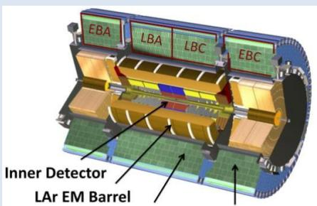  
Tile Barrel Tile Extended Barrel

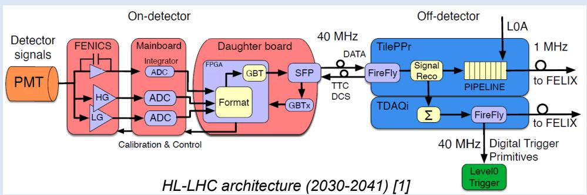  
HL-LHC architecture (2030-2041) [1]

## TileCal Phase-II upgrade electronics and the Demonstrator

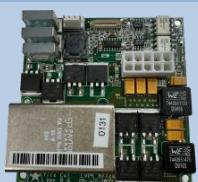  
1792 x Low Voltage power supply bricks
☐ 200V → 10V

## On-detector

896 x MainBoards

\- Control and configuration
- FENICS signal digitization
- 2 x 12-bit ADCs @ 40 Msps
- 1 x 16-bit ADC for integrator

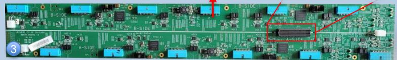

## 9852 x FENICS cards ←

☐ PMT pulse shaping with bi-gain amplification (1:40)

☐ Current integrator for luminosity measurements and Cs calibration

measurements and Cs calibration (Demonstrator version with 1:32 gain ratio and analog trigger outputs)

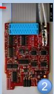

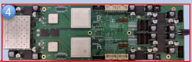  
896 x DaughterBoards
☐ Clock and configuration distribution
☐ Transmission of detector data  
\~1000 x new PMTs
□ Hamamatsu R11187
□ Quantum Efficiency > 15%

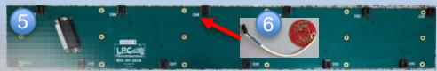  
896 x High Voltage (HV) distribution board
9852 x HV Active Dividers
☐ Better PMT linearity at high current

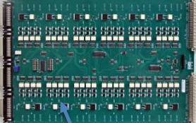

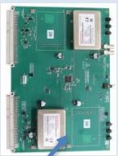  
256 x HV remote and power supply boards
☐ Provide individual control, monitoring and regulation per PMT

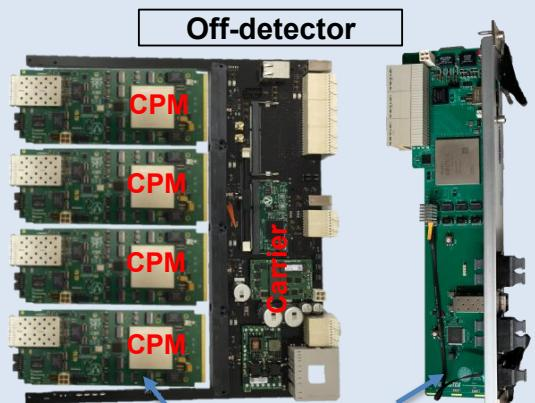

☐ Data acquisition and energy reconstruction @ LHC bunch crossing frequency

☐ Distribution of the LHC clock to the on-detector electronics

☐ Interface with the ATLAS readout (1 MHz) and trigger systems (40 MHz)

## Clock and readout architecture of the Demonstrator

☐ Validation of the HL-LHC clock and readout architecture, and Phase-II electronics

☐ Installed during Long Shutdown 2 (2019-2022) and operated throughout Run 3 (2022-2026)

☐ Equipped with the latest TileCal Phase-II upgrade electronics

☐ Backward-compatible with the current ATLAS Trigger, Data Acquisition and Detector Control systems

☐ In the off-detector, the Compact Processing Module interfaces upgrade and legacy systems

Front-End Link eXchange  
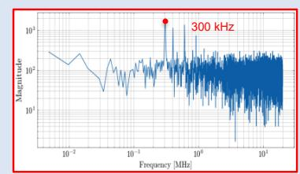  
Frequency spectrum of channel 17

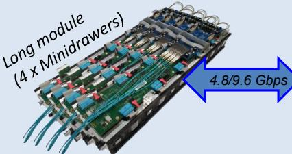  
Clock and configuration
Monitoring and detector data

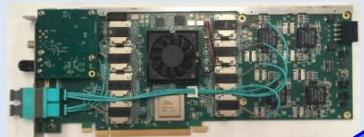

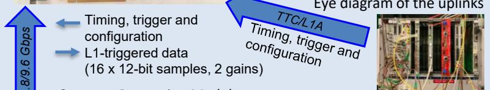  
Compact Processing Module

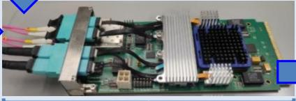  
☐ Data acquisition, processing and storing in memories

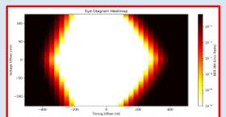

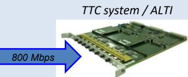  
L1-triggered events ReadOut Driver (7 x 10-bit samples, 1 gain)

☐ FELIX-based clock, trigger and configuration distribution to the on-detector electronics

☐ Receiving and storing detector data in off-detector pipeline memories at the LHC frequency

☐ Transmission of Level-1 triggered data to legacy TileCal DAQ system

☐ Certification with standalone software tools for data integrity and system stability studies

☐ Commissioning in ATLAS through laser and Charge Injection calibration runs

## Results and summary of the Demonstrator program in Run 3

The Demonstrator has operated successfully inside ATLAS during Run 3, validating the upgraded readout architecture under real detector conditions. The system demonstrates stable timing, calibration and physics performance, while providing essential operational feedback for the final HL-LHC TileCal electronics.

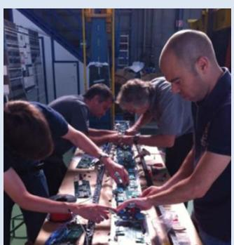  
Assembly in building 175 at CERN

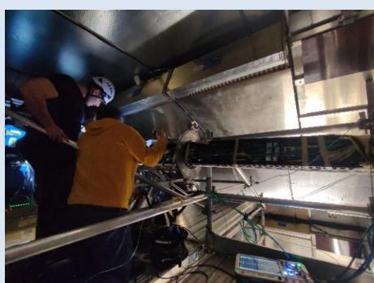  
Maintenance in the ATLAS experiment

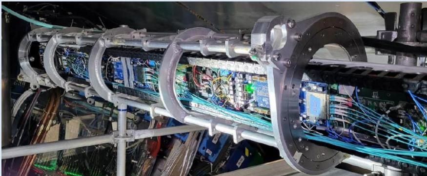  
Extracted Demonstrator module during maintenance

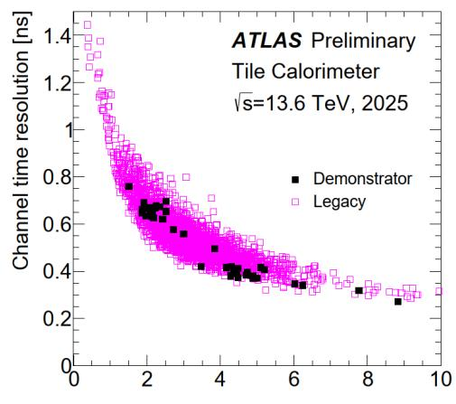  
$E_{mean}$ [GeV]  
Time resolution measured with 2025 laser calibration data in the Long Barrel A partition. [1]

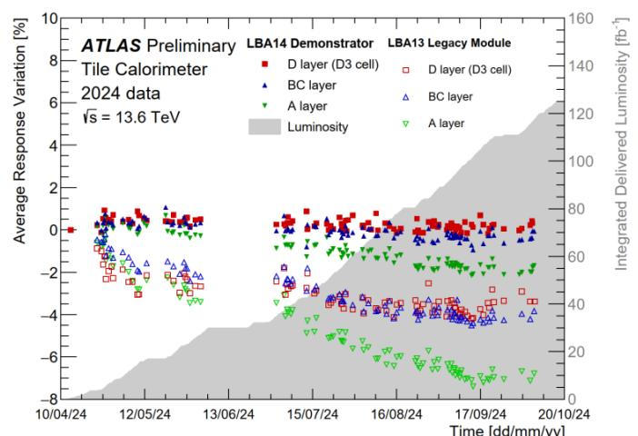  
Average relative response variation measured in individual TileCal layers in the Demonstrator and a neighbouring legacy module during 2024 [1]